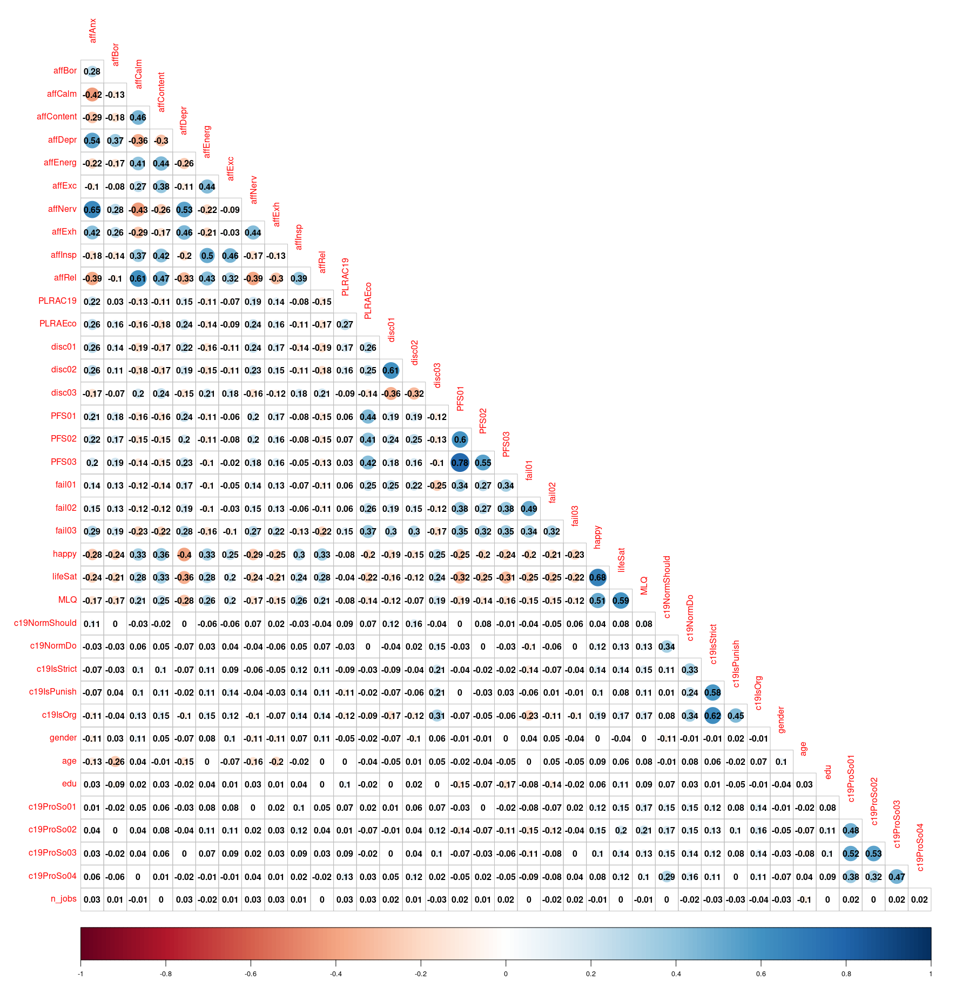

```{r setup, include=FALSE}
knitr::opts_chunk$set(echo = TRUE)
if("package:vegan" %in% search()) detach("package:vegan", unload=TRUE) 
```

# Libraries

```{r echo=TRUE, eval=TRUE, message=FALSE}
library(corrplot)
library(cluster)
library(dplyr)
library(flextable)
library(ggplot2)
```

# Creating new data set

```{r echo=TRUE, eval=TRUE}
# creating the dataset 
rm(list = ls())
set.seed(28795016)
cv_base.original = read.csv('/Users/swickremasinghe/Documents/FIT3152-Assignment2/PsyCoronaBaselineExtract.csv')

cv_base.new <- cv_base.original[sample(nrow(cv_base.original), 40000),]

cv_base <- cv_base.new

# resetting the row names for the data frame
rownames(cv_base) <- NULL
rownames(cv_base.new) <- NULL
```

# Functions

```{r echo=TRUE, eval=TRUE}
# function to make density plots for variables
make_density_plots <- function(data_set, column_name) {
    plot(density(as.numeric(unlist(data_set[column_name])),
                 na.rm = TRUE),
         main = paste(toupper(column_name), "density plot"))
}

# function to make correlation plots
make_correlation_plot <- function(dataset_) {
    corrplot(
        corr = cor(dataset_, use = "pairwise.complete.obs", method = "pearson"),
        type = 'lower',
        diag = FALSE,
        addCoef.col = 'black'
    )
}

# function for making the network plot
make_network_plot <- function(df_, correlation_limit=0.4, colors_=c("firebrick2", "dodgerblue2"), area) {
    
    # load the given data frame 
    ggraph(df_ %>% 
               # calculate correlation
               correlate(method="pearson", diagonal = 1) %>% 
               # stretch the data to long form
               stretch() %>%
               # filter the data to get the value to a certain correlation limit
               filter(abs(r) > correlation_limit) %>%
               # plot the data frame
               graph_from_data_frame()) +
        geom_edge_link(aes(edge_alpha = abs(r),
                           edge_width = abs(r),
                           color = r),
                       check_overlap = TRUE,
                       show.legend = FALSE) +
        geom_node_point(color = 'black') +
        geom_node_text(aes(label = name),
                       repel = TRUE,
                       check_overlap = TRUE) +
        theme_graph() +
        scale_edge_colour_gradientn(limits = c(-1, 1),
                                    colors = colors_) +
        ggtitle(paste("Correlation Network for", 
                      area, "| abs(r) > ", correlation_limit))
}

# function to remove the employee columns and provide a clean data set
get_clean_df <- function(dataFrame) {
    jobs_ <- as.data.frame(rowSums(dataFrame[17:26],
                                   na.rm = TRUE),
                           row.names = NULL)
    
    colnames(jobs_) <- 'n_jobs'
    
    dataFrame_ <- as.data.frame(cbind(dataFrame[1:16],
                                      dataFrame[27:43],
                                      dataFrame[45:48],
                                      dataFrame[44:44],
                                      jobs_))
    
    rownames(dataFrame_) <- NULL
    
    # remove
    
    dataFrame_ <- na.omit(dataFrame_)
    
    return(dataFrame_)
}
```

# Q1) Descriptive analysis and pre-processing

## Dimensions of the data set

To determine the dimension of the data, we can ue the `dim` keyword as follows,

```{r, cache=TRUE}
# get the dimensions of the data
dim(cv_base)
```

This tells us that the data set under investigation has 40,000 rows and 54 columns in total.

## Column names of the data set

The name of the columns of the data set can be determined using `names` keyword as follows,

```{r, cache=TRUE}
# get the column names
names(cv_base)
```

## Determining the number of missing values

To determine the number of missing values per column, we take the sum of the columns using `colSums` keyword and save that as a new data frame to print.

```{r, cache=TRUE, eval=TRUE, results='markup'}
# read the sum of NaN values as a data frame
na_values <- data.frame(colSums(is.na(cv_base)))

# convert the indices to a column
na_values$name <- rownames(na_values)

# reset the data frame index
rownames(na_values) <- NULL

# change the column names of data frame
colnames(na_values) <- c('NaN Values', 'Names')

# print
print(na_values)
```

The result shows no `NA` values in `coded_country` columns. We can also check for empty string here,

```{r echo=TRUE, cache=TRUE, eval=TRUE}
# get the total number of rows with coded_country = ""
sum(cv_base$coded_country == "")
```

So there are 160 rows with no country name attached to them. We'll remove these values from the data set for analysis.

## Determining the type of each column

We can also determine the type of each column by applying the `class` keyword to each column separately using `lapply`.

```{r, echo=TRUE, cache=TRUE, eval=TRUE}
# get what class of data is available in the data frame
dataClasses <- lapply(cv_base, class)

# get unique names from the new data set
dataClasses.unique <- unique(dataClasses)

# make them into a list
dataClasses.list <- unlist(dataClasses.unique)

# print
print(dataClasses.list)
```

So there are two two data classes, let's see what's the number of variables for these data classes

```{r echo=TRUE, cache=TRUE, eval=TRUE}
n_int <- sum(dataClasses == dataClasses.list[1])
n_chr <- sum(dataClasses == dataClasses.list[2])
```

```{r echo=TRUE, cache=TRUE, eval=TRUE}
print(
    paste(
        "No. of columns with" ,
        dataClasses.list[2],
        "class is",
        n_chr,
        "and with",
        dataClasses.list[1],
        "class are",
        n_int
    )
)
```

## Summary of the data

We can get a summary for all variables included by using the `summary` command. We can also get a look at the total `NA` values in the data by summing the column sum over the entire data set.

### NA values

To determine the number of `NA` values, we make a bar plot of the sum of `NA` values present in the data.

```{r echo=TRUE, cache=TRUE, eval=TRUE, fig.width=12, fig.height=8}
par(mar = c(8, 5, 2, 0.1))

barplot(
    colSums(is.na(cv_base) | cv_base$coded_country == ""),
    log = 'y',
    las = 2,
    ylab = 'No. of NA values'
)
```

### Summary

Now that we know the number of `NA` values in the data set, we now take a look at the summary

```{r echo=TRUE, cache=TRUE}
summary(cv_base)
```

## Removing NA values

For further data analysis, we remove the `NA` values from `coded_country`, `age`, `edu`, and `gender` columns first, and than we remove the columns

1.  `trustGovCity` \| 45
2.  `trustGovState` \| 46
3.  `jbInsec01` \| 17
4.  `jbInsec02` \| 18
5.  `jbInsec03` \| 19
6.  `jbInsec04` \| 20

Due to large number of NA values.

```{r echo=TRUE, cache=TRUE, eval=TRUE}
# removing the columns defined above
cv_base <- cv_base[, -17:-20]
cv_base <- cv_base[, -41:-42]
```

Now we can move towards getting a more clean data set

```{r echo=TRUE, cache=TRUE, eval=TRUE}
cv_base <- cv_base[cv_base$coded_country != "",]
cv_base <- get_clean_df(cv_base)
```

## Data visualization

For the purpose of general data visualization, we consider the following concept classes to be of importance as they are more personal to each individual

```         
1. Affect
2. Likelihood
3. Societal Discontent
4. Job Insecurity
5. Perceived Financial Strain
6. Disempowerment
7. Life Satisfaction
8. Corona ProSocial Behavior
```

The `employment status` columns was dealt separately. We also investigate the trends in

```         
1. Gender
2. Age
3. Education
4. Country
```

```{r echo=TRUE, eval=TRUE, cache=TRUE}
perm_ <- cbind(cv_base[, 31:33], cv_base[38:38])
```

### Age, Gender, Education and Countries

Density plots are useful to know which values have been repeated more than what values in the given data set. For the data set with `age`, `edu`, and `gender` we can make the density plots for each data set,

```{r echo=TRUE, eval=TRUE, cache=TRUE, fig.align='center', fig.width=10, fig.height=4}
par(mfrow=c(1, 3))

names_ <- names(perm_)

for (i in seq(1, 3)) {
  make_density_plots(perm_, names_[i])
}
```

These plots show that the survey has more responses from audience of younger age groups, `18-24`, `25-34`, and `35-44` and the most participants have either `vocational` or `higher education`.

We also see that the majority of the participants are `females`. The estimate of these parameters can be found using the `group_by` function in `dplyr` library

```{r echo=TRUE, eval=TRUE, cache=TRUE, fig.align='center', fig.width=10, fig.height=18}
as.data.frame(count(group_by(cv_base, age)))
as.data.frame(count(group_by(cv_base, edu)))
as.data.frame(count(group_by(cv_base, gender)))

ggplot(cv_base, aes(y = coded_country, col = factor(age))) + 
    geom_bar() + 
    scale_x_continuous(trans = 'log10') + 
    labs(title = "Age wise distribution of number of participants",
         y = "Countries",
         x = "No. of participants")
```

### Personal factors

Now we try to find the correlation between the factors in the survey that are related to the experiences on a personal level, e.g., `affect`, vs. `likelihood`, `societal discontent`, `job insecurity`, `perceived financial strain`, `disempowerment`, and `life statisfaction`.

The concepts like `Corona Community Injunctive Norms` and `Trust in Government` were not included with personal analysis as they might not be dependent on personal feelings related to `affect` concept.

```{r echo=TRUE, cache=TRUE, eval=TRUE}
# combined personal factors with life choices
cv_base.correlation_plot <- cv_base[, -38]
```

```{r echo=TRUE, cache=TRUE, eval=FALSE}
make_correlation_plot(cv_base.correlation_plot)
```

{#personal_heatmap .heatmap width="1210"}

For the most part, the negative parameters are correlated to one another and vice verse for positive parameters.

People that show the symptoms of anxiety, boredom, depression and exhaustion often are socially discontent, have insecurities about their jobs, aren't happy with their lives and don't have clear sense of purpose either.

An interesting take here is that almost no parameter has a strong correlation with `Corona Pro Social Behavior` (r \> 0.3) except for themselves.

### Corona Pro Social Behavior

Now that we know that CPSB is not a factor that is correlated to any other factor, we make a separate analysis on it.

```{r echo=TRUE, cache=TRUE, eval=TRUE, fig.align='center', message=FALSE}
par(mfrow=c(2,2))

for (i in names(cv_base[34:37])) {
    make_density_plots(cv_base, i)
}
```

```{r echo=FALSE, cache=TRUE, eval=TRUE, message=FALSE, warning=FALSE}
temp_ <- dev.off()
```

There seem to be a general positive "protection" trend seen in the data e.g., people are willing to make sacrifices to protect others.

### Employment status

To check for the employment status of the participants, we can make use of `no of jobs` field and make a `barplot` to know how many participants are undertaking how many jobs

```{r echo=TRUE, cache=TRUE, eval=TRUE}
# get a tabulate form of total number of participants pre employment status
n_employees <- t(as.data.frame(colSums(cv_base.new[21:30], na.rm = TRUE)))

colnames(n_employees) <- c('Emp_1', 'Emp_2', 'Emp_3', 'Emp_4', 'Emp_5', 
                           'Emp_6', 'Emp_7', 'Emp_8', 'Emp_9', 'Emp_10')
```

```{r echo=TRUE, cache=TRUE, eval=TRUE, fig.align='center'}
job_table <- table(cv_base$n_jobs)

barplot(job_table,
        log = 'y',
        xlab = 'Number of jobs',
        ylab = 'Number of participants')
```

Here we can see that most of the participants have only one job, but there is a quota of people having more than 5 jobs as well.

```{r echo=TRUE, cache=TRUE, eval=TRUE, fig.align='center'}
barplot(n_employees,
        log = 'y',
        col = 'gray',
        las = 2)
```

This is a bi-modal distribution with the most participants taking part in `40+ hour per week` and `student` employment status respectively.

# Pro-Social attribute predictors

The focus country by the ID `28795016` is `Bangladesh` in `FocusCountryByID.pdf`.

```{r echo=TRUE, cache=TRUE, eval=TRUE}
bangladesh_df <- cv_base[cv_base$coded_country == 'Bangladesh',]
```

## Q2A) General responses difference

For a general response we can look at the mean values of the two data sets,

```{r echo=TRUE, cache=TRUE, eval=TRUE}
world_df <- cv_base[cv_base$coded_country != 'Bangladesh',]
```

```{r echo=TRUE, cache=TRUE, eval=TRUE, fig.align='center', fig.width=12, fig.height=8}
bangladesh.mean <- colMeans(bangladesh_df[,-38], na.rm = TRUE)
world.mean <- colMeans(world_df[,-38], na.rm = TRUE)

difference_ <- bangladesh.mean - world.mean

mean_ <- mean(difference_)
sd_ <- sd(difference_)

plot(
    difference_,
    main = "Parameter difference between\nBangladesh and Rest of the world",
    xlab = "Parameter Number",
    ylab = "Difference",
    xlim = c(-1, 40)
)

abline(
    h = mean_,
    col = 'red',
    lwd = 3,
    lty = 2
)
abline(
    h = mean_ + sd_,
    col = 'pink',
    lwd = 3,
    lty = 3
)
abline(
    h = mean_ - sd_,
    col = 'pink',
    lwd = 3,
    lty = 3
)
text(seq(1:length(world_df[, -38])), difference_ + 0.05, names(world_df[, -38]))

legend(
    0,-0.85,
    legend = c('Mean difference value', 'Mean +/- SD'),
    col = c('red', 'pink'),
    lty = c(2, 3),
    lwd = 3
)
```

The plot shows that for the most part of the survey, Bangladesh is more negative from the rest of the world.

It has more average **anxiety**, **nervousness**, **depression** and **exhaustion**. However, this is not true for all personal components as Bangladesh averages more in **energetic** and **excited** as well.

The Bangladeshi people **do more jobs** on average**.** They are **more financially strained**, feel **more disempowered**, and are extremely worried about the **economic consequences**.

They also tend to be **extremely unhappy** and are generally **not satisfied** by their life. On the other hand, they do show a better **sense of where their life is headed towards** as they are **more educated**. They **do not believe** that **strict COVID policies** should be enforced.

Despite all the negativity, they are **more willing to help other people** in need (Pro-Social behavior) on average.

## Q2B) Pro-Social attitude predictors \| Focus country

For the pro-social attitude predictors, we take help of linear regression. The steps to determine the best predictors will be as follow,

1.  Determine the initial best predictors using the entire data set.
2.  Use those best predictors to further refine the best predictors via another `lm`.

### `c19ProSo01`

```{r echo=TRUE, cache=TRUE, eval=TRUE}
bangladesh_df.ProSo01.lm.fit <- lm(c19ProSo01 ~ ., data = bangladesh_df[,-38])
summary(bangladesh_df.ProSo01.lm.fit)
```

Overall, we do not see any strong predictors for `c19ProSo01` for the focus country. However, we do have some weak predictors which we can test again.

```{r echo=TRUE, cache=TRUE, eval=TRUE}
bangladesh_df.ProSo01.lm.fit <-
    lm(c19ProSo01 ~ PFS01 + PFS02 + c19IsStrict, data = bangladesh_df[,-38])
summary(bangladesh_df.ProSo01.lm.fit)
```

Even after singling out the predictors, the only significant one is `c19IsStrict`. We now repeat this for the other Pro-Social behaviors as well and summarize the predictors at the end.

### `c19ProSo02`

```{r echo=TRUE, cache=TRUE, eval=TRUE}
bangladesh_df.ProSo02.lm.fit <-
    lm(c19ProSo02 ~ ., data = bangladesh_df[, -38])
summary(bangladesh_df.ProSo02.lm.fit)
```

```{r echo=TRUE, cache=TRUE, eval=TRUE}
cv_band.ProSo02.lm.fit.2 <-
    lm(c19ProSo02 ~ affExc + fail02, data = cv_base[, -38])
summary(cv_band.ProSo02.lm.fit.2)
```

### `c19ProSo03`

```{r echo=TRUE, cache=TRUE, eval=TRUE}
bangladesh_df.ProSo03.lm.fit <- lm(c19ProSo03 ~ ., data = bangladesh_df[, -38])
summary(bangladesh_df.ProSo03.lm.fit)
```

```{r echo=TRUE, cache=TRUE, eval=TRUE}
bangladesh_df.ProSo03.lm.fit.2 <-
    lm(c19ProSo03 ~ PLRAEco, data = bangladesh_df[, -38])
summary(bangladesh_df.ProSo03.lm.fit.2)
```

### `c19ProSo04`

```{r echo=TRUE, cache=TRUE, eval=TRUE}
bangladesh_df.ProSo04.lm.fit <- lm(c19ProSo04 ~ ., data = bangladesh_df[, -38])
summary(bangladesh_df.ProSo04.lm.fit)
```

```{r echo=TRUE, cache=TRUE, eval=TRUE}
bangladesh_df.ProSo04.lm.fit.2 <-
    lm(c19ProSo04 ~ gender, data = cv_base[, -38])
summary(bangladesh_df.ProSo04.lm.fit.2)
```

### Summary \| focus country {#summary-focus-country}

Below, we summarize the important predictors for Pro-Social behavior in `Bangladesh`.

```{r focus_country_summary, eval=TRUE, echo=FALSE, cache=TRUE, paged.print=TRUE}
temp_ <-
    tibble(
        Quantity = c("c19ProSo01", "c19ProSo02", "c19ProSo03", "c19ProSo04"),
        Predictors = c("c19IsStrict", paste("affExc", "\n", "fail02"), "", "gender"),
        Quality = c("**", paste("***", "\n", "***"), "", "***")
    )

flextable(temp_, cwidth = 2)
```

## Q2C) Pro-Social attitude predictors \| Rest of the world

Let's have a look at the Network map of the rest of the world,

### `c19ProSo01`

```{r echo=TRUE, cache=TRUE, eval=TRUE, warning=FALSE}
world_df.c19ProSo01.lm.fit <- lm(c19ProSo01~., data=world_df[, -38])
summary(world_df.c19ProSo01.lm.fit)
```

For the entire world as a group, there are a lot of predictors. Again, as with the focus country, the predictors will be passed to another `lm` and will be summarized at the end. However, to keep it simple, we only take the predictors with `**` significance and above.

```{r echo=TRUE, cache=TRUE, eval=TRUE}
world_df.c19ProSo01.lm.fit.2 <-
    lm(
        c19ProSo01 ~ affAnx + affExh + PLRAC19 + PLRAEco + disc02 + PFS01 + fail02 + fail03 + MLQ + c19NormDo + c19IsOrg + gender,
        data = world_df[,-38]
    )
summary(world_df.c19ProSo01.lm.fit.2)
```

### `c19ProSo02`

```{r echo=TRUE, cache=TRUE, eval=TRUE}
world_df.c19ProSo02.lm.fit <- lm(c19ProSo02 ~ ., data = world_df[,-38])
summary(world_df.c19ProSo02.lm.fit)
```

```{r echo=TRUE, cache=TRUE, eval=TRUE}
world_df.c19ProSo02.lm.fit.2 <-
    lm(
        c19ProSo02 ~ affAnx + affBor + affCalm + affDepr + affEnerg + affExc + affExh + affInsp + PLRAC19 + PLRAEco + disc01 + disc02 + disc03 + PFS01 + fail01 + lifeSat + MLQ + c19NormShould + c19IsPunish + c19IsOrg + gender + age + edu,
        data = world_df[,-38]
    )
summary(world_df.c19ProSo02.lm.fit.2)
```

### `c19ProSo03`

```{r echo=TRUE, cache=TRUE, eval=TRUE}
world_df.c19ProSo03.lm.fit <- lm(c19ProSo03 ~ ., data = world_df[, -38])
summary(world_df.c19ProSo03.lm.fit)
```

```{r echo=TRUE, eval=TRUE, cache=TRUE}
world_df.c19ProSo03.lm.fit.2 <-
    lm(
        c19ProSo03 ~ affBor + affDepr + affExc + PLRAC19 + PLRAEco + disc03 + PFS02 + fail02 + MLQ + c19NormShould + c19NormDo + c19IsOrg + gender + age + edu, data = world_df[,-38]
    )
summary(world_df.c19ProSo03.lm.fit.2)
```

### `c19ProSo04`

```{r echo=TRUE, cache=TRUE, eval=TRUE}
world_df.c19ProSo04.lm.fit <- lm(c19ProSo04 ~ ., data = world_df[,-38])
summary(world_df.c19ProSo04.lm.fit)
```

```{r echo=TRUE, cache=TRUE, eval=TRUE}
world_df.c19ProSo04.lm.fit.2 <-
    lm(
        c19ProSo04 ~ affBor + affDepr + affEnerg + affExc + PLRAC19 + disc02 + PFS01 + PFS02 + fail01 + fail02 + fail03 + lifeSat + c19NormShould + c19IsStrict + c19IsPunish + c19IsOrg + age,
        data = world_df[,-38]
    )
summary(world_df.c19ProSo04.lm.fit.2)
```

### Summary \| rest of the world {#summary-rest-of-the-world}

In the summary listed below, all the indicated parameters have a "\*\*\*" significance.

```{r other_countries_summary, eval=TRUE, echo=FALSE, cache=TRUE, paged.print=TRUE}
temp_ <-
    tibble(
        Quantity = c("c19ProSo01", "c19ProSo02", "c19ProSo03", "c19ProSo04"),
        Predictors = c(
            paste(
                "affExh,",
                "PLRAC19,",
                "disc02,",
                "fail02,",
                "fail03,",
                "MLQ,",
                "c19NormDo,",
                "c19IsOrg"
            ),
            paste(
                "affAnx,",
                "affBor,",
                "affCalm,",
                "affEnerg,",
                "affExc,",
                "affExh,",
                "affInsp,",
                "PLRAEco,",
                "disc02,",
                "disc03,",
                "PFS01,",
                "fail02,",
                "lifeSat,",
                "MLQ,",
                "c19NormShoul,",
                "c19IsPunish,",
                "c19IsOrg,",
                "age,",
                "edu"
            ),
            paste(
                "affBor,",
                "affDepr,",
                "affExc,",
                "PLRAC19,",
                "disc03,",
                "fail02,",
                "MLQ,",
                "c19NormShould,",
                "c19NormDo,",
                "c19IsOrg,",
                "age,",
                "edu"
            ),
            paste(
                "affBor,",
                "PLRAC19,",
                "disc03,",
                "PFS01,",
                "PFS02,",
                "fail01,",
                "fail02,",
                "fail03,",
                "lifeSat,",
                "c19NormShould,",
                "c19IsStrict,",
                "c19IsPunish,",
                "c19IsOrg,",
                "age"
            )
        ),
    )

flextable(temp_, cwidth = 3)
```

## Difference

There are a lot of predictors available for the data of other countries as a group when compared to the focus country `Bangladesh`.

There doesn't seem to be any overall good predictors for the focus country (see [Summary \| focus country](#summary-focus-country)), but a lot of predictors exist for the other country data (see [Summary \| rest of the world](#summary-rest-of-the-world)).

# Clustering

For clustering of the data, we use hierarchical clustering to know the countries that are most close to the focus country.

## Q3A) Similar country identification

The following steps were carried out for clustering,

1.  Remove the duplicated rows from `coded_country`,
    1.  omit any `NA` values,
    2.  `scale` the data,
2.  calculated the `distance` for each value,
3.  make `hierarchical cluster` for the data,
4.  select an appropriately sized cluster and identify similar countries,
5.  make cluster plots for visualizations

```{r echo=TRUE, cache=TRUE, eval=TRUE}
# remove the duplicate country data
my_data <- cv_base[!duplicated(cv_base$coded_country),]

# add the country names as index
rownames(my_data) <- my_data$coded_country

# select only relevant variables from the data set
my_data <- my_data[c("c19NormShould", "c19NormDo", "lifeSat", "MLQ", "fail02")]

# omit any NA values, precautionary measure
my_data <- na.omit(my_data)

# scale the data for clustering
my_data <- scale(my_data)
```

## Clustering

```{r echo=TRUE, cache=TRUE, eval=TRUE}
# calculate the distance
my_data.distance <- dist(my_data)

# generate the cluster
my_data.hcluster <- hclust(my_data.distance, method = "ward.D2")

# obtain the optimal number of clusters
k.max <- 15

wss <- sapply(1:k.max,
              function(k) {
                  kmeans(my_data, k, nstart = 50, iter.max = 15)$tot.withinss
              })

plot(1:k.max, wss,
     type="b", pch = 19, frame = FALSE, 
     xlab="Number of clusters K",
     ylab="Total within-clusters sum of squares")

print(wss)
```

As we can see here, that the `between_ss/total_ss` ratio tends to change slowly and remain less changing for `k > 2`, so we'll take `k = 2` as the optimal number of clusters. This can also be verified using `kmeans`

```{r echo=TRUE, cache=TRUE, eval=TRUE}
# make groups for the clusters
my_data.groups <- cutree(my_data.hcluster, k = 2)

# plot the cluster
clusplot(
    my_data,
    my_data.groups,
    color = TRUE,
    shade = TRUE,
    lines = 0,
    labels = 2
)
```

We can also see the clustering in form of `dandeogram`

```{r eval=TRUE, echo=TRUE, fig.align='center', fig.height=8, fig.width=15, cache=TRUE}
my_data.dendrogram <- as.dendrogram(my_data.hcluster)

node_parameters <-
    list(
        lab.cex = 0.6,
        pch = c(NA, 19),
        cex = 0.7,
        col = "blue"
    )

plot(my_data.dendrogram,
     nodePar = node_parameters,
     edgePar = list(col = 1:2, lwd = 2:1))
```

We observe here that the countries on the same cluster level as `Bangladesh` are,

1.  `Singapore`
2.  `Algeria`
3.  `Italy`
4.  `Nigeria`, and
5.  `Mali`

For this case study, we consider the countries with higher number of participants than the focus country to have a decent sample size. For this, we can check the dimensions of each selected country.

```{r echo=TRUE, cache=TRUE, eval=TRUE}
countries <- c("Singapore", "Algeria", "Italy", "Nigeria", "Mali", "Bangladesh")

for (country in countries) {
    print(paste("participants from ", country, "=", dim(cv_base[cv_base$coded_country == country,])[1]))
}
```

Based on the number of participants, we limit the selection to `Singapore`, `Algeria`, and `Italy` as a cluster. In order to study the Pro-Social behaviors we combine these countries and search for the predictors again,

## Q3B) Joint predictor search

We create a subset of the original data that comprises of the four required countries,

```{r echo=TRUE, cache=TRUE, eval=TRUE}

joint_df <- subset(
    cv_base,
    coded_country %in% c(
        'Singapore',
        'Algeria',
        'Italy'
    )
)

rownames(joint_df) <- NULL
```

Now we search for the predictors for Pro-Social behavior as described above again for this joint country cluster

### `c19SoPro01`

```{r echo=TRUE, cache=TRUE, eval=TRUE}
joint_df.ProSo01.lm.fit <- lm(c19ProSo01~., data=joint_df[, -38])
summary(joint_df.ProSo01.lm.fit)
```

```{r echo=TRUE, cache=TRUE, eval=TRUE}
joint_df.ProSo01.lm.fit.2 <-
    lm(c19ProSo01 ~ affAnx + affExh + disc01 + disc02 + c19IsPunish + gender,
       data = joint_df[,-38])
summary(joint_df.ProSo01.lm.fit.2)
```

### `c19ProSo02`

```{r echo=TRUE, cache=TRUE, eval=TRUE}
joint_df.ProSo02.lm.fit <- lm(c19ProSo02~., data=joint_df[, -38])
summary(joint_df.ProSo02.lm.fit)
```

```{r echo=TRUE, cache=TRUE, eval=TRUE}
joint_df.ProSo02.lm.fit.2 <-
    lm(c19ProSo02 ~ affAnx + PLRAEco + disc03 + fail01 + c19NormShould + gender,
       data = joint_df[, -38])
summary(joint_df.ProSo02.lm.fit.2)
```

### `c19ProSo03`

```{r echo=TRUE, cache=TRUE, eval=TRUE}
joint_df.ProSo03.lm.fit <- lm(c19ProSo03~., data=joint_df[, -38])
summary(joint_df.ProSo03.lm.fit)
```

```{r echo=TRUE, cache=TRUE, eval=TRUE}
joint_df.ProSo03.lm.fit.2 <-
    lm(c19ProSo03 ~ affContent + affNerv + PLRAEco + gender,
       data = joint_df[,-38])
summary(joint_df.ProSo03.lm.fit.2)
```

### `c19ProSo04`

```{r echo=TRUE, cache=TRUE, eval=TRUE}
joint_df.ProSo04.lm.fit <- lm(c19ProSo04~., data=joint_df[, -38])
summary(joint_df.ProSo04.lm.fit)
```

```{r echo=TRUE, cache=TRUE, eval=TRUE}
joint_df.ProSo04.lm.fit.2 <-
    lm(c19ProSo04 ~ affExc + disc01 + disc02 + PFS02 + fail02 + fail03 + c19NormShould + gender,
       data = joint_df[,-38])
summary(joint_df.ProSo04.lm.fit.2)
```

#### Summary \| Joint cluster

Below, we summarize the important predictors for Pro-Social behavior for the joint country cluster,

```{r cluster_country_summary, eval=TRUE, echo=FALSE, cache=TRUE, paged.print=TRUE}
temp_ <-
    tibble(
        Quantity = c("c19ProSo01", "c19ProSo02", "c19ProSo03", "c19ProSo04"),
        Predictors = c(
            paste("affAnx\n", "affExh\n", "disc01\n", "disc02\n", "c19IsPunish"),
            paste("affAnx\n", "PLRAEco\n", "disc03\n", "fail01\n", "c19NormShould"),
            "affContent",
            paste("disc01\n", "disc02\n", "fail02\n", "fail03\n", "c19NormShould\n", "gender")
        ),
        Quality = c(
            paste("**\n", "*\n", "***\n", "***\n", "***"),
            paste("**\n", "***\n", "***\n", "***\n", "***"),
            "***",
            paste("***\n", "***\n", "*\n", "***\n", "**\n", "***\n", "**")
        )
    )

flextable(temp_, cwidth = 2)
```

## Q3C) Explanation and comparison

The joint cluster of `Singapore`, `Algeria`, and `Italy` provides some predictors for the Pro-Social behaviors, and some are found to be quite significant.

While no common predictor was found for the cluster and the focus country alone, but we do see similar predictors in some cases. For example, `c19ProSo02` has `Affect` and `Fail` predictors. `Corona Injunctive Norms` predictors are also found in `c19proSo01` for both these cases.

This behavior of predictors may suggest that the prediction should be done for each `Concept` individually or a better predictive measure should be taken into account.

As a comparison to the cluster and the rest of the world, we can again take a look at the comparison plot for the mean concept values

```{r echo=TRUE, cache=TRUE, eval=TRUE, fig.align='center', fig.height=8, fig.width=12}

world_df <- subset(cv_base,!coded_country %in% c("Singapore",
                                                 "Algeria",
                                                 "Italy"))

rownames(joint_df) <- NULL
joint_df.mean <- colMeans(joint_df[,-38], na.rm = TRUE)
world_df.mean <- colMeans(world_df[,-38], na.rm = TRUE)

difference_ <- joint_df.mean - world_df.mean

mean_ <- mean(difference_)
sd_ <- sd(difference_)

plot(
    difference_,
    main = "Parameter difference between\nthe joint cluster and rest of the world",
    xlab = "Parameter Number",
    ylab = "Difference",
    xlim = c(-1, 40)
)

abline(
    h = mean_,
    col = 'red',
    lwd = 3,
    lty = 2
)
abline(
    h = mean_ + sd_,
    col = 'pink',
    lwd = 3,
    lty = 3
)
abline(
    h = mean_ - sd_,
    col = 'pink',
    lwd = 3,
    lty = 3
)
text(seq(1:length(world_df[,-38])) - 0.1, difference_ + 0.02, names(world_df[,-38]))

legend(
    0,
    -0.85,
    legend = c('Mean difference value', 'Mean +/- SD'),
    col = c('red', 'pink'),
    lty = c(2, 3),
    lwd = 3
)
```

With the clustered data, we see a decrease in range of difference from the rest of the world. The people in the joint cluster are not **energetic** on average compared to the rest of the world and have more **anxiety**, and **nervousness**. It should be noted that they people in this cluster have a lot of behaviors within `1σ` standard deviation.

Overall, they are **not** **happier** on average and they think highly of the **COVID norms**. These factors indicate a variation from the focused country although they belong to the same cluster.

It is also to be noted that since the focus country doens't has too many predictors, both the joint cluster and the world wide cluster do not represent the patterns of the focus country any better. But the similar cluster does show few indicators for Pro-Social behavior as does the focus country analysis.

# Appendix

## Selection of the clustering variables

For the clustering of the variable, the online table was consulted and parameters present in the data set matching the description were selected with the following values.

|        Variable        | Rank | Permutation Importance |
|:----------------------:|:----:|:----------------------:|
| Should social distance |  1   |         0.154          |
|   Do social distance   |  7   |         0.031          |
|   Life Satisfaction    |  47  |         0.004          |
|    Sense of purpose    |  48  |         0.004          |
|    Dis-empowerment     |  53  |         0.003          |
