Bangladesh COVID-19 Analysis
================

During the early stages of the COVID-19 pandemic, researchers surveyed participants around the
globe. A baseline study was conducted with the aim of identifying the most important predictors of
pro-social COVID-19 behaviours, that is, actions that would reduce the spread of the virus.
This assignment investigates Bangladesh's country level predictors of pro-social behaviours to reduce the spread of COVID-19 during the early stages of the pandemic

================
# Libraries

``` r
library(corrplot)
library(cluster)
library(dplyr)
library(flextable)
library(ggplot2)
```

# Creating new data set

``` r
# creating the dataset 
rm(list = ls())
set.seed(28795016)
cv_base.original = read.csv('/Users/swickremasinghe/Documents/FIT3152-Assignment2/PsyCoronaBaselineExtract.csv')

cv_base.new <- cv_base.original[sample(nrow(cv_base.original), 40000),]

cv_base <- cv_base.new

# resetting the row names for the data frame
rownames(cv_base) <- NULL
rownames(cv_base.new) <- NULL
```

# Functions

``` r
# function to make density plots for variables
make_density_plots <- function(data_set, column_name) {
    plot(density(as.numeric(unlist(data_set[column_name])),
                 na.rm = TRUE),
         main = paste(toupper(column_name), "density plot"))
}

# function to make correlation plots
make_correlation_plot <- function(dataset_) {
    corrplot(
        corr = cor(dataset_, use = "pairwise.complete.obs", method = "pearson"),
        type = 'lower',
        diag = FALSE,
        addCoef.col = 'black'
    )
}

# function for making the network plot
make_network_plot <- function(df_, correlation_limit=0.4, colors_=c("firebrick2", "dodgerblue2"), area) {
    
    # load the given data frame 
    ggraph(df_ %>% 
               # calculate correlation
               correlate(method="pearson", diagonal = 1) %>% 
               # stretch the data to long form
               stretch() %>%
               # filter the data to get the value to a certain correlation limit
               filter(abs(r) > correlation_limit) %>%
               # plot the data frame
               graph_from_data_frame()) +
        geom_edge_link(aes(edge_alpha = abs(r),
                           edge_width = abs(r),
                           color = r),
                       check_overlap = TRUE,
                       show.legend = FALSE) +
        geom_node_point(color = 'black') +
        geom_node_text(aes(label = name),
                       repel = TRUE,
                       check_overlap = TRUE) +
        theme_graph() +
        scale_edge_colour_gradientn(limits = c(-1, 1),
                                    colors = colors_) +
        ggtitle(paste("Correlation Network for", 
                      area, "| abs(r) > ", correlation_limit))
}

# function to remove the employee columns and provide a clean data set
get_clean_df <- function(dataFrame) {
    jobs_ <- as.data.frame(rowSums(dataFrame[17:26],
                                   na.rm = TRUE),
                           row.names = NULL)
    
    colnames(jobs_) <- 'n_jobs'
    
    dataFrame_ <- as.data.frame(cbind(dataFrame[1:16],
                                      dataFrame[27:43],
                                      dataFrame[45:48],
                                      dataFrame[44:44],
                                      jobs_))
    
    rownames(dataFrame_) <- NULL
    
    # remove
    
    dataFrame_ <- na.omit(dataFrame_)
    
    return(dataFrame_)
}
```

# Q1) Descriptive analysis and pre-processing

## Dimensions of the data set

To determine the dimension of the data, we can ue the `dim` keyword as
follows,

``` r
# get the dimensions of the data
dim(cv_base)
```

    ## [1] 40000    54

This tells us that the data set under investigation has 40,000 rows and
54 columns in total.

## Column names of the data set

The name of the columns of the data set can be determined using `names`
keyword as follows,

``` r
# get the column names
names(cv_base)
```

    ##  [1] "affAnx"          "affBor"          "affCalm"         "affContent"     
    ##  [5] "affDepr"         "affEnerg"        "affExc"          "affNerv"        
    ##  [9] "affExh"          "affInsp"         "affRel"          "PLRAC19"        
    ## [13] "PLRAEco"         "disc01"          "disc02"          "disc03"         
    ## [17] "jbInsec01"       "jbInsec02"       "jbInsec03"       "jbInsec04"      
    ## [21] "employstatus_1"  "employstatus_2"  "employstatus_3"  "employstatus_4" 
    ## [25] "employstatus_5"  "employstatus_6"  "employstatus_7"  "employstatus_8" 
    ## [29] "employstatus_9"  "employstatus_10" "PFS01"           "PFS02"          
    ## [33] "PFS03"           "fail01"          "fail02"          "fail03"         
    ## [37] "happy"           "lifeSat"         "MLQ"             "c19NormShould"  
    ## [41] "c19NormDo"       "c19IsStrict"     "c19IsPunish"     "c19IsOrg"       
    ## [45] "trustGovCtry"    "trustGovState"   "gender"          "age"            
    ## [49] "edu"             "coded_country"   "c19ProSo01"      "c19ProSo02"     
    ## [53] "c19ProSo03"      "c19ProSo04"

## Determining the number of missing values

To determine the number of missing values per column, we take the sum of
the columns using `colSums` keyword and save that as a new data frame to
print.

``` r
# read the sum of NaN values as a data frame
na_values <- data.frame(colSums(is.na(cv_base)))

# convert the indices to a column
na_values$name <- rownames(na_values)

# reset the data frame index
rownames(na_values) <- NULL

# change the column names of data frame
colnames(na_values) <- c('NaN Values', 'Names')

# print
print(na_values)
```

    ##    NaN Values           Names
    ## 1         515          affAnx
    ## 2         532          affBor
    ## 3         523         affCalm
    ## 4         610      affContent
    ## 5         605         affDepr
    ## 6         642        affEnerg
    ## 7         687          affExc
    ## 8         554         affNerv
    ## 9         630          affExh
    ## 10        673         affInsp
    ## 11        600          affRel
    ## 12        135         PLRAC19
    ## 13        156         PLRAEco
    ## 14        122          disc01
    ## 15        117          disc02
    ## 16        120          disc03
    ## 17      10965       jbInsec01
    ## 18       9830       jbInsec02
    ## 19       8339       jbInsec03
    ## 20      12914       jbInsec04
    ## 21      34313  employstatus_1
    ## 22      33241  employstatus_2
    ## 23      29079  employstatus_3
    ## 24      36536  employstatus_4
    ## 25      37976  employstatus_5
    ## 26      36892  employstatus_6
    ## 27      36366  employstatus_7
    ## 28      39292  employstatus_8
    ## 29      31822  employstatus_9
    ## 30      39091 employstatus_10
    ## 31        149           PFS01
    ## 32        127           PFS02
    ## 33        128           PFS03
    ## 34        134          fail01
    ## 35        131          fail02
    ## 36        121          fail03
    ## 37        518           happy
    ## 38        107         lifeSat
    ## 39        114             MLQ
    ## 40        130   c19NormShould
    ## 41        125       c19NormDo
    ## 42        154     c19IsStrict
    ## 43        155     c19IsPunish
    ## 44        148        c19IsOrg
    ## 45       9402    trustGovCtry
    ## 46       9482   trustGovState
    ## 47        197          gender
    ## 48        216             age
    ## 49        267             edu
    ## 50          0   coded_country
    ## 51        110      c19ProSo01
    ## 52        125      c19ProSo02
    ## 53        133      c19ProSo03
    ## 54        142      c19ProSo04

The result shows no `NA` values in `coded_country` columns. We can also
check for empty string here,

``` r
# get the total number of rows with coded_country = ""
sum(cv_base$coded_country == "")
```

    ## [1] 160

So there are 160 rows with no country name attached to them. We’ll
remove these values from the data set for analysis.

## Determining the type of each column

We can also determine the type of each column by applying the `class`
keyword to each column separately using `lapply`.

``` r
# get what class of data is available in the data frame
dataClasses <- lapply(cv_base, class)

# get unique names from the new data set
dataClasses.unique <- unique(dataClasses)

# make them into a list
dataClasses.list <- unlist(dataClasses.unique)

# print
print(dataClasses.list)
```

    ## [1] "integer"   "character"

So there are two two data classes, let’s see what’s the number of
variables for these data classes

``` r
n_int <- sum(dataClasses == dataClasses.list[1])
n_chr <- sum(dataClasses == dataClasses.list[2])
```

``` r
print(
    paste(
        "No. of columns with" ,
        dataClasses.list[2],
        "class is",
        n_chr,
        "and with",
        dataClasses.list[1],
        "class are",
        n_int
    )
)
```

    ## [1] "No. of columns with character class is 1 and with integer class are 53"

## Summary of the data

We can get a summary for all variables included by using the `summary`
command. We can also get a look at the total `NA` values in the data by
summing the column sum over the entire data set.

### NA values

To determine the number of `NA` values, we make a bar plot of the sum of
`NA` values present in the data.

``` r
par(mar = c(8, 5, 2, 0.1))

barplot(
    colSums(is.na(cv_base) | cv_base$coded_country == ""),
    log = 'y',
    las = 2,
    ylab = 'No. of NA values'
)
```

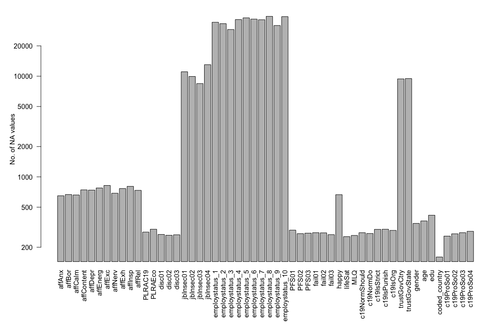<!-- -->

### Summary

Now that we know the number of `NA` values in the data set, we now take
a look at the summary

``` r
summary(cv_base)
```

    ##      affAnx          affBor         affCalm        affContent   
    ##  Min.   :1.000   Min.   :1.000   Min.   :1.000   Min.   :1.000  
    ##  1st Qu.:2.000   1st Qu.:2.000   1st Qu.:2.000   1st Qu.:2.000  
    ##  Median :3.000   Median :3.000   Median :3.000   Median :3.000  
    ##  Mean   :2.726   Mean   :2.715   Mean   :2.925   Mean   :2.682  
    ##  3rd Qu.:4.000   3rd Qu.:4.000   3rd Qu.:4.000   3rd Qu.:3.000  
    ##  Max.   :5.000   Max.   :5.000   Max.   :5.000   Max.   :5.000  
    ##  NA's   :515     NA's   :532     NA's   :523     NA's   :610    
    ##     affDepr         affEnerg         affExc         affNerv         affExh     
    ##  Min.   :1.000   Min.   :1.000   Min.   :1.000   Min.   :1.00   Min.   :1.000  
    ##  1st Qu.:1.000   1st Qu.:2.000   1st Qu.:1.000   1st Qu.:2.00   1st Qu.:1.000  
    ##  Median :2.000   Median :3.000   Median :2.000   Median :2.00   Median :2.000  
    ##  Mean   :2.239   Mean   :2.578   Mean   :2.154   Mean   :2.59   Mean   :2.507  
    ##  3rd Qu.:3.000   3rd Qu.:3.000   3rd Qu.:3.000   3rd Qu.:4.00   3rd Qu.:3.000  
    ##  Max.   :5.000   Max.   :5.000   Max.   :5.000   Max.   :5.00   Max.   :5.000  
    ##  NA's   :605     NA's   :642     NA's   :687     NA's   :554    NA's   :630    
    ##     affInsp          affRel         PLRAC19         PLRAEco     
    ##  Min.   :1.000   Min.   :1.000   Min.   :1.000   Min.   :1.000  
    ##  1st Qu.:1.000   1st Qu.:2.000   1st Qu.:3.000   1st Qu.:3.000  
    ##  Median :2.000   Median :3.000   Median :4.000   Median :4.000  
    ##  Mean   :2.438   Mean   :2.737   Mean   :3.553   Mean   :4.393  
    ##  3rd Qu.:3.000   3rd Qu.:4.000   3rd Qu.:4.000   3rd Qu.:6.000  
    ##  Max.   :5.000   Max.   :5.000   Max.   :8.000   Max.   :8.000  
    ##  NA's   :673     NA's   :600     NA's   :135     NA's   :156    
    ##      disc01            disc02            disc03          jbInsec01     
    ##  Min.   :-2.0000   Min.   :-2.0000   Min.   :-2.0000   Min.   :-2.000  
    ##  1st Qu.: 0.0000   1st Qu.: 0.0000   1st Qu.:-1.0000   1st Qu.:-2.000  
    ##  Median : 1.0000   Median : 1.0000   Median : 0.0000   Median :-1.000  
    ##  Mean   : 0.6383   Mean   : 0.8336   Mean   :-0.4038   Mean   :-0.597  
    ##  3rd Qu.: 1.0000   3rd Qu.: 1.0000   3rd Qu.: 0.0000   3rd Qu.: 0.000  
    ##  Max.   : 2.0000   Max.   : 2.0000   Max.   : 2.0000   Max.   : 2.000  
    ##  NA's   :122       NA's   :117       NA's   :120       NA's   :10965   
    ##    jbInsec02        jbInsec03        jbInsec04     employstatus_1 
    ##  Min.   :-2.000   Min.   :-2.000   Min.   :-2.00   Min.   :1      
    ##  1st Qu.: 0.000   1st Qu.:-1.000   1st Qu.:-2.00   1st Qu.:1      
    ##  Median : 1.000   Median : 0.000   Median :-2.00   Median :1      
    ##  Mean   : 0.563   Mean   : 0.055   Mean   :-0.98   Mean   :1      
    ##  3rd Qu.: 1.000   3rd Qu.: 1.000   3rd Qu.: 0.00   3rd Qu.:1      
    ##  Max.   : 2.000   Max.   : 2.000   Max.   : 2.00   Max.   :1      
    ##  NA's   :9830     NA's   :8339     NA's   :12914   NA's   :34313  
    ##  employstatus_2  employstatus_3  employstatus_4  employstatus_5 
    ##  Min.   :1       Min.   :1       Min.   :1       Min.   :1      
    ##  1st Qu.:1       1st Qu.:1       1st Qu.:1       1st Qu.:1      
    ##  Median :1       Median :1       Median :1       Median :1      
    ##  Mean   :1       Mean   :1       Mean   :1       Mean   :1      
    ##  3rd Qu.:1       3rd Qu.:1       3rd Qu.:1       3rd Qu.:1      
    ##  Max.   :1       Max.   :1       Max.   :1       Max.   :1      
    ##  NA's   :33241   NA's   :29079   NA's   :36536   NA's   :37976  
    ##  employstatus_6  employstatus_7  employstatus_8  employstatus_9 
    ##  Min.   :1       Min.   :1       Min.   :1       Min.   :1      
    ##  1st Qu.:1       1st Qu.:1       1st Qu.:1       1st Qu.:1      
    ##  Median :1       Median :1       Median :1       Median :1      
    ##  Mean   :1       Mean   :1       Mean   :1       Mean   :1      
    ##  3rd Qu.:1       3rd Qu.:1       3rd Qu.:1       3rd Qu.:1      
    ##  Max.   :1       Max.   :1       Max.   :1       Max.   :1      
    ##  NA's   :36892   NA's   :36366   NA's   :39292   NA's   :31822  
    ##  employstatus_10     PFS01              PFS02             PFS03        
    ##  Min.   :1       Min.   :-2.00000   Min.   :-2.0000   Min.   :-2.0000  
    ##  1st Qu.:1       1st Qu.:-1.00000   1st Qu.: 0.0000   1st Qu.:-1.0000  
    ##  Median :1       Median : 0.00000   Median : 1.0000   Median : 0.0000  
    ##  Mean   :1       Mean   :-0.02735   Mean   : 0.5684   Mean   :-0.2509  
    ##  3rd Qu.:1       3rd Qu.: 1.00000   3rd Qu.: 1.0000   3rd Qu.: 1.0000  
    ##  Max.   :1       Max.   : 2.00000   Max.   : 2.0000   Max.   : 2.0000  
    ##  NA's   :39091   NA's   :149        NA's   :127       NA's   :128      
    ##      fail01             fail02            fail03            happy       
    ##  Min.   :-2.00000   Min.   :-2.0000   Min.   :-2.0000   Min.   : 1.000  
    ##  1st Qu.:-1.00000   1st Qu.:-1.0000   1st Qu.: 0.0000   1st Qu.: 5.000  
    ##  Median : 0.00000   Median :-1.0000   Median : 1.0000   Median : 7.000  
    ##  Mean   :-0.06296   Mean   :-0.4104   Mean   : 0.3521   Mean   : 6.339  
    ##  3rd Qu.: 1.00000   3rd Qu.: 0.0000   3rd Qu.: 1.0000   3rd Qu.: 8.000  
    ##  Max.   : 2.00000   Max.   : 2.0000   Max.   : 2.0000   Max.   :10.000  
    ##  NA's   :134        NA's   :131       NA's   :121       NA's   :518     
    ##     lifeSat           MLQ          c19NormShould      c19NormDo     
    ##  Min.   :1.000   Min.   :-3.0000   Min.   :-3.000   Min.   :-3.000  
    ##  1st Qu.:3.000   1st Qu.: 0.0000   1st Qu.: 2.000   1st Qu.: 1.000  
    ##  Median :4.000   Median : 1.0000   Median : 2.000   Median : 2.000  
    ##  Mean   :4.144   Mean   : 0.8484   Mean   : 2.005   Mean   : 1.301  
    ##  3rd Qu.:5.000   3rd Qu.: 2.0000   3rd Qu.: 3.000   3rd Qu.: 2.000  
    ##  Max.   :6.000   Max.   : 3.0000   Max.   : 3.000   Max.   : 3.000  
    ##  NA's   :107     NA's   :114       NA's   :130      NA's   :125     
    ##   c19IsStrict     c19IsPunish       c19IsOrg      trustGovCtry  
    ##  Min.   :1.000   Min.   :1.000   Min.   :1.000   Min.   :1.000  
    ##  1st Qu.:3.000   1st Qu.:2.000   1st Qu.:3.000   1st Qu.:2.000  
    ##  Median :4.000   Median :4.000   Median :4.000   Median :3.000  
    ##  Mean   :4.124   Mean   :3.503   Mean   :3.901   Mean   :3.009  
    ##  3rd Qu.:5.000   3rd Qu.:5.000   3rd Qu.:5.000   3rd Qu.:4.000  
    ##  Max.   :6.000   Max.   :6.000   Max.   :6.000   Max.   :5.000  
    ##  NA's   :154     NA's   :155     NA's   :148     NA's   :9402   
    ##  trustGovState       gender           age             edu       
    ##  Min.   :1.000   Min.   :1.000   Min.   :1.000   Min.   :1.000  
    ##  1st Qu.:2.000   1st Qu.:1.000   1st Qu.:2.000   1st Qu.:4.000  
    ##  Median :3.000   Median :1.000   Median :3.000   Median :5.000  
    ##  Mean   :3.081   Mean   :1.389   Mean   :2.896   Mean   :4.405  
    ##  3rd Qu.:4.000   3rd Qu.:2.000   3rd Qu.:4.000   3rd Qu.:5.000  
    ##  Max.   :5.000   Max.   :3.000   Max.   :8.000   Max.   :7.000  
    ##  NA's   :9482    NA's   :197     NA's   :216     NA's   :267    
    ##  coded_country        c19ProSo01        c19ProSo02        c19ProSo03     
    ##  Length:40000       Min.   :-3.0000   Min.   :-3.0000   Min.   :-3.0000  
    ##  Class :character   1st Qu.: 0.0000   1st Qu.: 0.0000   1st Qu.: 0.0000  
    ##  Mode  :character   Median : 1.0000   Median : 1.0000   Median : 1.0000  
    ##                     Mean   : 0.9826   Mean   : 0.6844   Mean   : 0.5505  
    ##                     3rd Qu.: 2.0000   3rd Qu.: 2.0000   3rd Qu.: 2.0000  
    ##                     Max.   : 3.0000   Max.   : 3.0000   Max.   : 3.0000  
    ##                     NA's   :110       NA's   :125       NA's   :133      
    ##    c19ProSo04    
    ##  Min.   :-3.000  
    ##  1st Qu.: 0.000  
    ##  Median : 2.000  
    ##  Mean   : 1.294  
    ##  3rd Qu.: 2.000  
    ##  Max.   : 3.000  
    ##  NA's   :142

## Removing NA values

For further data analysis, we remove the `NA` values from
`coded_country`, `age`, `edu`, and `gender` columns first, and than we
remove the columns

1.  `trustGovCity` \| 45
2.  `trustGovState` \| 46
3.  `jbInsec01` \| 17
4.  `jbInsec02` \| 18
5.  `jbInsec03` \| 19
6.  `jbInsec04` \| 20

Due to large number of NA values.

``` r
# removing the columns defined above
cv_base <- cv_base[, -17:-20]
cv_base <- cv_base[, -41:-42]
```

Now we can move towards getting a more clean data set

``` r
cv_base <- cv_base[cv_base$coded_country != "",]
cv_base <- get_clean_df(cv_base)
```

## Data visualization

For the purpose of general data visualization, we consider the following
concept classes to be of importance as they are more personal to each
individual

    1. Affect
    2. Likelihood
    3. Societal Discontent
    4. Job Insecurity
    5. Perceived Financial Strain
    6. Disempowerment
    7. Life Satisfaction
    8. Corona ProSocial Behavior

The `employment status` columns was dealt separately. We also
investigate the trends in

    1. Gender
    2. Age
    3. Education
    4. Country

``` r
perm_ <- cbind(cv_base[, 31:33], cv_base[38:38])
```

### Age, Gender, Education and Countries

Density plots are useful to know which values have been repeated more
than what values in the given data set. For the data set with `age`,
`edu`, and `gender` we can make the density plots for each data set,

``` r
par(mfrow=c(1, 3))

names_ <- names(perm_)

for (i in seq(1, 3)) {
  make_density_plots(perm_, names_[i])
}
```

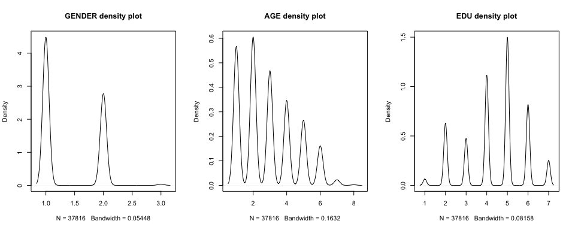

These plots show that the survey has more responses from audience of
younger age groups, `18-24`, `25-34`, and `35-44` and the most
participants have either `vocational` or `higher education`.

We also see that the majority of the participants are `females`. The
estimate of these parameters can be found using the `group_by` function
in `dplyr` library

``` r
as.data.frame(count(group_by(cv_base, age)))
```

    ##   age    n
    ## 1   1 8799
    ## 2   2 9386
    ## 3   3 7253
    ## 4   4 5366
    ## 5   5 4118
    ## 6   6 2504
    ## 7   7  353
    ## 8   8   37

``` r
as.data.frame(count(group_by(cv_base, edu)))
```

    ##   edu     n
    ## 1   1   505
    ## 2   2  4924
    ## 3   3  3693
    ## 4   4  8686
    ## 5   5 11650
    ## 6   6  6390
    ## 7   7  1968

``` r
as.data.frame(count(group_by(cv_base, gender)))
```

    ##   gender     n
    ## 1      1 23238
    ## 2      2 14383
    ## 3      3   195

``` r
ggplot(cv_base, aes(y = coded_country, col = factor(age))) + 
    geom_bar() + 
    scale_x_continuous(trans = 'log10') + 
    labs(title = "Age wise distribution of number of participants",
         y = "Countries",
         x = "No. of participants")
```

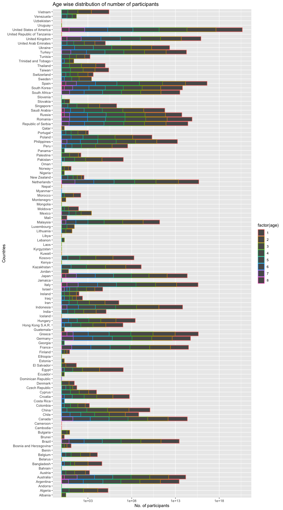

### Personal factors

Now we try to find the correlation between the factors in the survey
that are related to the experiences on a personal level, e.g., `affect`,
vs. `likelihood`, `societal discontent`, `job insecurity`,
`perceived financial strain`, `disempowerment`, and
`life statisfaction`.

The concepts like `Corona Community Injunctive Norms` and
`Trust in Government` were not included with personal analysis as they
might not be dependent on personal feelings related to `affect` concept.

``` r
# combined personal factors with life choices
cv_base.correlation_plot <- cv_base[, -38]
```

``` r
make_correlation_plot(cv_base.correlation_plot)
```


For the most part, the negative parameters are correlated to one another
and vice verse for positive parameters.

People that show the symptoms of anxiety, boredom, depression and
exhaustion often are socially discontent, have insecurities about their
jobs, aren’t happy with their lives and don’t have clear sense of
purpose either.

An interesting take here is that almost no parameter has a strong
correlation with `Corona Pro Social Behavior` (r \> 0.3) except for
themselves.

### Corona Pro Social Behavior

Now that we know that CPSB is not a factor that is correlated to any
other factor, we make a separate analysis on it.

``` r
par(mfrow=c(2,2))

for (i in names(cv_base[34:37])) {
    make_density_plots(cv_base, i)
}
```

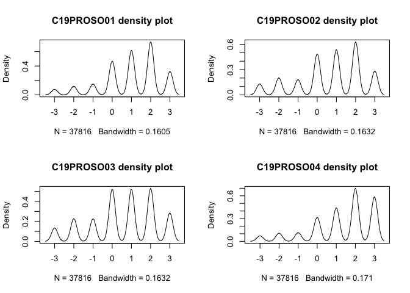

There seem to be a general positive “protection” trend seen in the data
e.g., people are willing to make sacrifices to protect others.

### Employment status

To check for the employment status of the participants, we can make use
of `no of jobs` field and make a `barplot` to know how many participants
are undertaking how many jobs

``` r
# get a tabulate form of total number of participants pre employment status
n_employees <- t(as.data.frame(colSums(cv_base.new[21:30], na.rm = TRUE)))

colnames(n_employees) <- c('Emp_1', 'Emp_2', 'Emp_3', 'Emp_4', 'Emp_5', 
                           'Emp_6', 'Emp_7', 'Emp_8', 'Emp_9', 'Emp_10')
```

``` r
job_table <- table(cv_base$n_jobs)

barplot(job_table,
        log = 'y',
        xlab = 'Number of jobs',
        ylab = 'Number of participants')
```

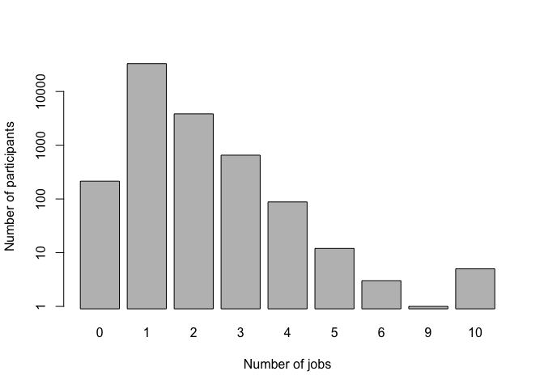

Here we can see that most of the participants have only one job, but
there is a quota of people having more than 5 jobs as well.

``` r
barplot(n_employees,
        log = 'y',
        col = 'gray',
        las = 2)
```

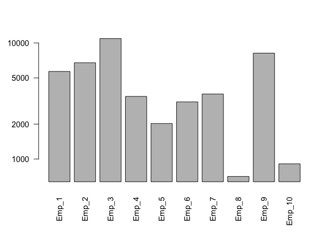

This is a bi-modal distribution with the most participants taking part
in `40+ hour per week` and `student` employment status respectively.

# Pro-Social attribute predictors

The focus country by the ID `28795016` is `Bangladesh` in
`FocusCountryByID.pdf`.

``` r
bangladesh_df <- cv_base[cv_base$coded_country == 'Bangladesh',]
```

## Q2A) General responses difference

For a general response we can look at the mean values of the two data
sets,

``` r
world_df <- cv_base[cv_base$coded_country != 'Bangladesh',]
```

``` r
bangladesh.mean <- colMeans(bangladesh_df[,-38], na.rm = TRUE)
world.mean <- colMeans(world_df[,-38], na.rm = TRUE)

difference_ <- bangladesh.mean - world.mean

mean_ <- mean(difference_)
sd_ <- sd(difference_)

plot(
    difference_,
    main = "Parameter difference between\nBangladesh and Rest of the world",
    xlab = "Parameter Number",
    ylab = "Difference",
    xlim = c(-1, 40)
)

abline(
    h = mean_,
    col = 'red',
    lwd = 3,
    lty = 2
)
abline(
    h = mean_ + sd_,
    col = 'pink',
    lwd = 3,
    lty = 3
)
abline(
    h = mean_ - sd_,
    col = 'pink',
    lwd = 3,
    lty = 3
)
text(seq(1:length(world_df[, -38])), difference_ + 0.05, names(world_df[, -38]))

legend(
    0,-0.85,
    legend = c('Mean difference value', 'Mean +/- SD'),
    col = c('red', 'pink'),
    lty = c(2, 3),
    lwd = 3
)
```

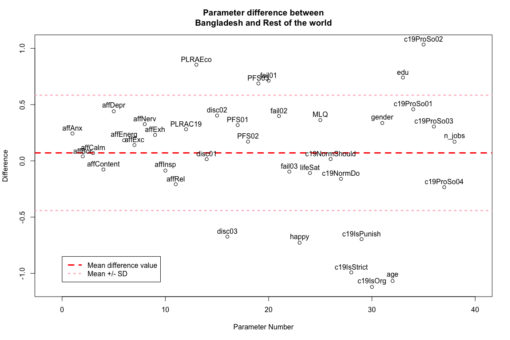

The plot shows that for the most part of the survey, Bangladesh is more
negative from the rest of the world.

It has more average **anxiety**, **nervousness**, **depression** and
**exhaustion**. However, this is not true for all personal components as
Bangladesh averages more in **energetic** and **excited** as well.

The Bangladeshi people **do more jobs** on average**.** They are **more
financially strained**, feel **more disempowered**, and are extremely
worried about the **economic consequences**.

They also tend to be **extremely unhappy** and are generally **not
satisfied** by their life. On the other hand, they do show a better
**sense of where their life is headed towards** as they are **more
educated**. They **do not believe** that **strict COVID policies**
should be enforced.

Despite all the negativity, they are **more willing to help other
people** in need (Pro-Social behavior) on average.

## Q2B) Pro-Social attitude predictors \| Focus country

For the pro-social attitude predictors, we take help of linear
regression. The steps to determine the best predictors will be as
follow,

1.  Determine the initial best predictors using the entire data set.
2.  Use those best predictors to further refine the best predictors via
    another `lm`.

### `c19ProSo01`

``` r
bangladesh_df.ProSo01.lm.fit <- lm(c19ProSo01 ~ ., data = bangladesh_df[,-38])
summary(bangladesh_df.ProSo01.lm.fit)
```

    ## 
    ## Call:
    ## lm(formula = c19ProSo01 ~ ., data = bangladesh_df[, -38])
    ## 
    ## Residuals:
    ##      Min       1Q   Median       3Q      Max 
    ## -2.40950 -0.40132  0.07598  0.43231  1.74903 
    ## 
    ## Coefficients:
    ##                Estimate Std. Error t value Pr(>|t|)    
    ## (Intercept)    2.002007   1.681694   1.190 0.239969    
    ## affAnx         0.049645   0.161539   0.307 0.759983    
    ## affBor        -0.064368   0.148324  -0.434 0.666340    
    ## affCalm       -0.021635   0.151897  -0.142 0.887362    
    ## affContent    -0.153001   0.178981  -0.855 0.397067    
    ## affDepr       -0.245987   0.142193  -1.730 0.090344 .  
    ## affEnerg       0.046662   0.147009   0.317 0.752367    
    ## affExc        -0.149031   0.163472  -0.912 0.366701    
    ## affNerv        0.135444   0.151873   0.892 0.377130    
    ## affExh        -0.113306   0.142807  -0.793 0.431605    
    ## affInsp        0.047050   0.153737   0.306 0.760953    
    ## affRel         0.084298   0.145351   0.580 0.564770    
    ## PLRAC19       -0.080259   0.121453  -0.661 0.512021    
    ## PLRAEco        0.096529   0.089009   1.084 0.283797    
    ## disc01        -0.027627   0.188214  -0.147 0.883945    
    ## disc02         0.032869   0.231395   0.142 0.887662    
    ## disc03         0.146167   0.200682   0.728 0.470089    
    ## PFS01         -0.426230   0.185667  -2.296 0.026303 *  
    ## PFS02          0.379964   0.175645   2.163 0.035753 *  
    ## PFS03          0.116964   0.216630   0.540 0.591854    
    ## fail01        -0.072752   0.160855  -0.452 0.653191    
    ## fail02         0.109178   0.169321   0.645 0.522263    
    ## fail03        -0.040491   0.184569  -0.219 0.827325    
    ## happy         -0.002006   0.121466  -0.017 0.986896    
    ## lifeSat       -0.104479   0.193166  -0.541 0.591201    
    ## MLQ            0.016942   0.106526   0.159 0.874329    
    ## c19NormShould -0.277974   0.140494  -1.979 0.053873 .  
    ## c19NormDo      0.080084   0.085874   0.933 0.355907    
    ## c19IsStrict   -0.361725   0.125714  -2.877 0.006062 ** 
    ## c19IsPunish    0.101388   0.133813   0.758 0.452504    
    ## c19IsOrg       0.179954   0.112941   1.593 0.117931    
    ## gender        -0.243078   0.417405  -0.582 0.563171    
    ## age           -0.191003   0.188924  -1.011 0.317304    
    ## edu            0.188187   0.191199   0.984 0.330141    
    ## c19ProSo02     0.639242   0.163285   3.915 0.000297 ***
    ## c19ProSo03     0.256887   0.106960   2.402 0.020415 *  
    ## c19ProSo04    -0.145562   0.103753  -1.403 0.167342    
    ## n_jobs         0.041910   0.203462   0.206 0.837714    
    ## ---
    ## Signif. codes:  0 '***' 0.001 '**' 0.01 '*' 0.05 '.' 0.1 ' ' 1
    ## 
    ## Residual standard error: 1.01 on 46 degrees of freedom
    ## Multiple R-squared:  0.7376, Adjusted R-squared:  0.5266 
    ## F-statistic: 3.495 on 37 and 46 DF,  p-value: 3.773e-05

Overall, we do not see any strong predictors for `c19ProSo01` for the
focus country. However, we do have some weak predictors which we can
test again.

``` r
bangladesh_df.ProSo01.lm.fit <-
    lm(c19ProSo01 ~ PFS01 + PFS02 + c19IsStrict, data = bangladesh_df[,-38])
summary(bangladesh_df.ProSo01.lm.fit)
```

    ## 
    ## Call:
    ## lm(formula = c19ProSo01 ~ PFS01 + PFS02 + c19IsStrict, data = bangladesh_df[, 
    ##     -38])
    ## 
    ## Residuals:
    ##     Min      1Q  Median      3Q     Max 
    ## -4.6474 -0.4638  0.3245  0.9041  2.4836 
    ## 
    ## Coefficients:
    ##             Estimate Std. Error t value Pr(>|t|)    
    ## (Intercept)  2.30694    0.36462   6.327 1.35e-08 ***
    ## PFS01       -0.18379    0.16962  -1.084  0.28181    
    ## PFS02        0.23573    0.17009   1.386  0.16963    
    ## c19IsStrict -0.31574    0.09708  -3.252  0.00168 ** 
    ## ---
    ## Signif. codes:  0 '***' 0.001 '**' 0.01 '*' 0.05 '.' 0.1 ' ' 1
    ## 
    ## Residual standard error: 1.383 on 80 degrees of freedom
    ## Multiple R-squared:  0.1432, Adjusted R-squared:  0.1111 
    ## F-statistic: 4.458 on 3 and 80 DF,  p-value: 0.006014

Even after singling out the predictors, the only significant one is
`c19IsStrict`. We now repeat this for the other Pro-Social behaviors as
well and summarize the predictors at the end.

### `c19ProSo02`

``` r
bangladesh_df.ProSo02.lm.fit <-
    lm(c19ProSo02 ~ ., data = bangladesh_df[, -38])
summary(bangladesh_df.ProSo02.lm.fit)
```

    ## 
    ## Call:
    ## lm(formula = c19ProSo02 ~ ., data = bangladesh_df[, -38])
    ## 
    ## Residuals:
    ##      Min       1Q   Median       3Q      Max 
    ## -1.11563 -0.39900  0.02148  0.30020  1.75241 
    ## 
    ## Coefficients:
    ##                Estimate Std. Error t value Pr(>|t|)    
    ## (Intercept)    1.475957   1.317410   1.120 0.268381    
    ## affAnx        -0.093747   0.125703  -0.746 0.459592    
    ## affBor         0.164457   0.113676   1.447 0.154755    
    ## affCalm       -0.112437   0.117654  -0.956 0.344241    
    ## affContent     0.027069   0.141022   0.192 0.848626    
    ## affDepr        0.041017   0.114602   0.358 0.722049    
    ## affEnerg      -0.101026   0.114125  -0.885 0.380640    
    ## affExc         0.254132   0.123430   2.059 0.045190 *  
    ## affNerv       -0.051739   0.119551  -0.433 0.667200    
    ## affExh         0.004838   0.112441   0.043 0.965869    
    ## affInsp       -0.139262   0.118587  -1.174 0.246300    
    ## affRel        -0.134734   0.112343  -1.199 0.236548    
    ## PLRAC19       -0.136546   0.093283  -1.464 0.150053    
    ## PLRAEco       -0.021557   0.070421  -0.306 0.760900    
    ## disc01        -0.121626   0.146130  -0.832 0.409532    
    ## disc02         0.235957   0.177626   1.328 0.190600    
    ## disc03         0.094052   0.157234   0.598 0.552661    
    ## PFS01          0.141670   0.151862   0.933 0.355750    
    ## PFS02         -0.122972   0.143035  -0.860 0.394394    
    ## PFS03         -0.166895   0.168159  -0.992 0.326155    
    ## fail01         0.224363   0.121657   1.844 0.071597 .  
    ## fail02        -0.335278   0.123487  -2.715 0.009299 ** 
    ## fail03         0.178196   0.142006   1.255 0.215872    
    ## happy         -0.094662   0.093961  -1.007 0.318982    
    ## lifeSat        0.051929   0.151350   0.343 0.733082    
    ## MLQ            0.002251   0.083330   0.027 0.978569    
    ## c19NormShould  0.140576   0.112559   1.249 0.218017    
    ## c19NormDo      0.010891   0.067770   0.161 0.873029    
    ## c19IsStrict    0.057323   0.106460   0.538 0.592865    
    ## c19IsPunish   -0.088261   0.104492  -0.845 0.402667    
    ## c19IsOrg      -0.018999   0.090686  -0.210 0.834983    
    ## gender         0.136132   0.327014   0.416 0.679135    
    ## age            0.190901   0.146704   1.301 0.199646    
    ## edu            0.050810   0.150906   0.337 0.737872    
    ## c19ProSo01     0.390955   0.099864   3.915 0.000297 ***
    ## c19ProSo03     0.021662   0.088679   0.244 0.808108    
    ## c19ProSo04     0.112650   0.081175   1.388 0.171904    
    ## n_jobs        -0.178829   0.156991  -1.139 0.260555    
    ## ---
    ## Signif. codes:  0 '***' 0.001 '**' 0.01 '*' 0.05 '.' 0.1 ' ' 1
    ## 
    ## Residual standard error: 0.7895 on 46 degrees of freedom
    ## Multiple R-squared:  0.742,  Adjusted R-squared:  0.5345 
    ## F-statistic: 3.575 on 37 and 46 DF,  p-value: 2.823e-05

``` r
cv_band.ProSo02.lm.fit.2 <-
    lm(c19ProSo02 ~ affExc + fail02, data = cv_base[, -38])
summary(cv_band.ProSo02.lm.fit.2)
```

    ## 
    ## Call:
    ## lm(formula = c19ProSo02 ~ affExc + fail02, data = cv_base[, -38])
    ## 
    ## Residuals:
    ##     Min      1Q  Median      3Q     Max 
    ## -4.3987 -0.8952  0.2580  1.2360  2.9146 
    ## 
    ## Coefficients:
    ##              Estimate Std. Error t value Pr(>|t|)    
    ## (Intercept)  0.282467   0.018417   15.34   <2e-16 ***
    ## affExc       0.153188   0.007565   20.25   <2e-16 ***
    ## fail02      -0.175143   0.007506  -23.33   <2e-16 ***
    ## ---
    ## Signif. codes:  0 '***' 0.001 '**' 0.01 '*' 0.05 '.' 0.1 ' ' 1
    ## 
    ## Residual standard error: 1.623 on 37813 degrees of freedom
    ## Multiple R-squared:  0.02544,    Adjusted R-squared:  0.02539 
    ## F-statistic: 493.6 on 2 and 37813 DF,  p-value: < 2.2e-16

### `c19ProSo03`

``` r
bangladesh_df.ProSo03.lm.fit <- lm(c19ProSo03 ~ ., data = bangladesh_df[, -38])
summary(bangladesh_df.ProSo03.lm.fit)
```

    ## 
    ## Call:
    ## lm(formula = c19ProSo03 ~ ., data = bangladesh_df[, -38])
    ## 
    ## Residuals:
    ##     Min      1Q  Median      3Q     Max 
    ## -2.5331 -0.4940  0.0459  0.5705  2.0659 
    ## 
    ## Coefficients:
    ##                Estimate Std. Error t value Pr(>|t|)  
    ## (Intercept)   -0.571044   2.217031  -0.258   0.7979  
    ## affAnx        -0.003716   0.210122  -0.018   0.9860  
    ## affBor        -0.144087   0.191957  -0.751   0.4567  
    ## affCalm        0.171413   0.195796   0.875   0.3859  
    ## affContent    -0.347304   0.228750  -1.518   0.1358  
    ## affDepr        0.096212   0.190155   0.506   0.6153  
    ## affEnerg       0.161792   0.189741   0.853   0.3982  
    ## affExc         0.217961   0.211906   1.029   0.3091  
    ## affNerv        0.098380   0.198516   0.496   0.6226  
    ## affExh         0.159162   0.185352   0.859   0.3950  
    ## affInsp       -0.157422   0.198620  -0.793   0.4321  
    ## affRel        -0.010214   0.189555  -0.054   0.9573  
    ## PLRAC19       -0.018896   0.158540  -0.119   0.9056  
    ## PLRAEco       -0.228014   0.112200  -2.032   0.0479 *
    ## disc01        -0.248886   0.241858  -1.029   0.3088  
    ## disc02        -0.224318   0.298920  -0.750   0.4568  
    ## disc03        -0.235839   0.259953  -0.907   0.3690  
    ## PFS01          0.456167   0.245664   1.857   0.0697 .
    ## PFS02         -0.236730   0.237008  -0.999   0.3231  
    ## PFS03          0.195412   0.280910   0.696   0.4902  
    ## fail01         0.255196   0.206075   1.238   0.2219  
    ## fail02         0.144042   0.219989   0.655   0.5159  
    ## fail03        -0.343330   0.234557  -1.464   0.1501  
    ## happy          0.065753   0.157537   0.417   0.6783  
    ## lifeSat        0.125305   0.251121   0.499   0.6202  
    ## MLQ           -0.081754   0.137934  -0.593   0.5563  
    ## c19NormShould  0.229839   0.187126   1.228   0.2256  
    ## c19NormDo     -0.140903   0.110703  -1.273   0.2095  
    ## c19IsStrict   -0.118179   0.176590  -0.669   0.5067  
    ## c19IsPunish    0.321233   0.168428   1.907   0.0627 .
    ## c19IsOrg       0.021009   0.150721   0.139   0.8898  
    ## gender        -0.614344   0.536790  -1.144   0.2583  
    ## age            0.203735   0.246379   0.827   0.4126  
    ## edu            0.064280   0.250870   0.256   0.7989  
    ## c19ProSo01     0.433750   0.180600   2.402   0.0204 *
    ## c19ProSo02     0.059804   0.244826   0.244   0.8081  
    ## c19ProSo04     0.190909   0.134765   1.417   0.1633  
    ## n_jobs        -0.154051   0.263527  -0.585   0.5617  
    ## ---
    ## Signif. codes:  0 '***' 0.001 '**' 0.01 '*' 0.05 '.' 0.1 ' ' 1
    ## 
    ## Residual standard error: 1.312 on 46 degrees of freedom
    ## Multiple R-squared:  0.6373, Adjusted R-squared:  0.3456 
    ## F-statistic: 2.185 on 37 and 46 DF,  p-value: 0.006168

``` r
bangladesh_df.ProSo03.lm.fit.2 <-
    lm(c19ProSo03 ~ PLRAEco, data = bangladesh_df[, -38])
summary(bangladesh_df.ProSo03.lm.fit.2)
```

    ## 
    ## Call:
    ## lm(formula = c19ProSo03 ~ PLRAEco, data = bangladesh_df[, -38])
    ## 
    ## Residuals:
    ##     Min      1Q  Median      3Q     Max 
    ## -4.2333 -0.7720  0.3433  1.1127  2.4586 
    ## 
    ## Coefficients:
    ##             Estimate Std. Error t value Pr(>|t|)   
    ## (Intercept)  1.46400    0.52008   2.815  0.00611 **
    ## PLRAEco     -0.11533    0.09298  -1.240  0.21838   
    ## ---
    ## Signif. codes:  0 '***' 0.001 '**' 0.01 '*' 0.05 '.' 0.1 ' ' 1
    ## 
    ## Residual standard error: 1.616 on 82 degrees of freedom
    ## Multiple R-squared:  0.01842,    Adjusted R-squared:  0.006446 
    ## F-statistic: 1.538 on 1 and 82 DF,  p-value: 0.2184

### `c19ProSo04`

``` r
bangladesh_df.ProSo04.lm.fit <- lm(c19ProSo04 ~ ., data = bangladesh_df[, -38])
summary(bangladesh_df.ProSo04.lm.fit)
```

    ## 
    ## Call:
    ## lm(formula = c19ProSo04 ~ ., data = bangladesh_df[, -38])
    ## 
    ## Residuals:
    ##     Min      1Q  Median      3Q     Max 
    ## -3.3391 -0.6331  0.0042  0.6507  3.0731 
    ## 
    ## Coefficients:
    ##                Estimate Std. Error t value Pr(>|t|)  
    ## (Intercept)    4.240453   2.292325   1.850   0.0708 .
    ## affAnx        -0.183190   0.223405  -0.820   0.4165  
    ## affBor        -0.327902   0.201103  -1.631   0.1098  
    ## affCalm        0.132138   0.210530   0.628   0.5333  
    ## affContent    -0.150573   0.250061  -0.602   0.5500  
    ## affDepr        0.021119   0.204190   0.103   0.9181  
    ## affEnerg      -0.102717   0.204243  -0.503   0.6174  
    ## affExc         0.385556   0.222387   1.734   0.0897 .
    ## affNerv        0.403473   0.204701   1.971   0.0548 .
    ## affExh        -0.219868   0.197445  -1.114   0.2713  
    ## affInsp       -0.274209   0.210310  -1.304   0.1988  
    ## affRel         0.003458   0.203011   0.017   0.9865  
    ## PLRAC19       -0.063627   0.169557  -0.375   0.7092  
    ## PLRAEco       -0.044544   0.125268  -0.356   0.7238  
    ## disc01        -0.482773   0.252129  -1.915   0.0618 .
    ## disc02        -0.479661   0.314224  -1.526   0.1337  
    ## disc03        -0.021750   0.280860  -0.077   0.9386  
    ## PFS01          0.253918   0.270196   0.940   0.3523  
    ## PFS02         -0.173118   0.255290  -0.678   0.5011  
    ## PFS03          0.455279   0.294876   1.544   0.1294  
    ## fail01        -0.212689   0.222144  -0.957   0.3434  
    ## fail02         0.267264   0.233391   1.145   0.2581  
    ## fail03        -0.322066   0.252559  -1.275   0.2086  
    ## happy          0.105778   0.168314   0.628   0.5328  
    ## lifeSat       -0.045344   0.269584  -0.168   0.8672  
    ## MLQ            0.049440   0.148105   0.334   0.7400  
    ## c19NormShould -0.106892   0.203053  -0.526   0.6011  
    ## c19NormDo     -0.206045   0.116740  -1.765   0.0842 .
    ## c19IsStrict   -0.261136   0.186097  -1.403   0.1673  
    ## c19IsPunish    0.142338   0.186197   0.764   0.4485  
    ## c19IsOrg      -0.016631   0.161431  -0.103   0.9184  
    ## gender        -1.306069   0.550285  -2.373   0.0219 *
    ## age           -0.249841   0.263251  -0.949   0.3475  
    ## edu            0.394806   0.262486   1.504   0.1394  
    ## c19ProSo01    -0.281897   0.200930  -1.403   0.1673  
    ## c19ProSo02     0.356707   0.257043   1.388   0.1719  
    ## c19ProSo03     0.218963   0.154569   1.417   0.1633  
    ## n_jobs        -0.097829   0.282905  -0.346   0.7311  
    ## ---
    ## Signif. codes:  0 '***' 0.001 '**' 0.01 '*' 0.05 '.' 0.1 ' ' 1
    ## 
    ## Residual standard error: 1.405 on 46 degrees of freedom
    ## Multiple R-squared:  0.6145, Adjusted R-squared:  0.3045 
    ## F-statistic: 1.982 on 37 and 46 DF,  p-value: 0.01409

``` r
bangladesh_df.ProSo04.lm.fit.2 <-
    lm(c19ProSo04 ~ gender, data = cv_base[, -38])
summary(bangladesh_df.ProSo04.lm.fit.2)
```

    ## 
    ## Call:
    ## lm(formula = c19ProSo04 ~ gender, data = cv_base[, -38])
    ## 
    ## Residuals:
    ##     Min      1Q  Median      3Q     Max 
    ## -4.3864 -1.1786  0.6136  1.6136  2.0293 
    ## 
    ## Coefficients:
    ##             Estimate Std. Error t value Pr(>|t|)    
    ## (Intercept)  1.59432    0.02379   67.01   <2e-16 ***
    ## gender      -0.20787    0.01610  -12.91   <2e-16 ***
    ## ---
    ## Signif. codes:  0 '***' 0.001 '**' 0.01 '*' 0.05 '.' 0.1 ' ' 1
    ## 
    ## Residual standard error: 1.561 on 37814 degrees of freedom
    ## Multiple R-squared:  0.004387,   Adjusted R-squared:  0.00436 
    ## F-statistic: 166.6 on 1 and 37814 DF,  p-value: < 2.2e-16

### Summary \| focus country

Below, we summarize the important predictors for Pro-Social behavior in
`Bangladesh`.

<div class="tabwid"><style>.cl-3e26498a{}.cl-3e22b450{font-family:'Helvetica';font-size:11pt;font-weight:normal;font-style:normal;text-decoration:none;color:rgba(0, 0, 0, 1.00);background-color:transparent;}.cl-3e24470c{margin:0;text-align:left;border-bottom: 0 solid rgba(0, 0, 0, 1.00);border-top: 0 solid rgba(0, 0, 0, 1.00);border-left: 0 solid rgba(0, 0, 0, 1.00);border-right: 0 solid rgba(0, 0, 0, 1.00);padding-bottom:5pt;padding-top:5pt;padding-left:5pt;padding-right:5pt;line-height: 1;background-color:transparent;}.cl-3e244ff4{width:2in;background-color:transparent;vertical-align: middle;border-bottom: 1.5pt solid rgba(102, 102, 102, 1.00);border-top: 1.5pt solid rgba(102, 102, 102, 1.00);border-left: 0 solid rgba(0, 0, 0, 1.00);border-right: 0 solid rgba(0, 0, 0, 1.00);margin-bottom:0;margin-top:0;margin-left:0;margin-right:0;}.cl-3e244ffe{width:2in;background-color:transparent;vertical-align: middle;border-bottom: 0 solid rgba(0, 0, 0, 1.00);border-top: 0 solid rgba(0, 0, 0, 1.00);border-left: 0 solid rgba(0, 0, 0, 1.00);border-right: 0 solid rgba(0, 0, 0, 1.00);margin-bottom:0;margin-top:0;margin-left:0;margin-right:0;}.cl-3e244fff{width:2in;background-color:transparent;vertical-align: middle;border-bottom: 1.5pt solid rgba(102, 102, 102, 1.00);border-top: 0 solid rgba(0, 0, 0, 1.00);border-left: 0 solid rgba(0, 0, 0, 1.00);border-right: 0 solid rgba(0, 0, 0, 1.00);margin-bottom:0;margin-top:0;margin-left:0;margin-right:0;}</style><table data-quarto-disable-processing='true' class='cl-3e26498a'><thead><tr style="overflow-wrap:break-word;"><th class="cl-3e244ff4"><p class="cl-3e24470c"><span class="cl-3e22b450">Quantity</span></p></th><th class="cl-3e244ff4"><p class="cl-3e24470c"><span class="cl-3e22b450">Predictors</span></p></th><th class="cl-3e244ff4"><p class="cl-3e24470c"><span class="cl-3e22b450">Quality</span></p></th></tr></thead><tbody><tr style="overflow-wrap:break-word;"><td class="cl-3e244ffe"><p class="cl-3e24470c"><span class="cl-3e22b450">c19ProSo01</span></p></td><td class="cl-3e244ffe"><p class="cl-3e24470c"><span class="cl-3e22b450">c19IsStrict</span></p></td><td class="cl-3e244ffe"><p class="cl-3e24470c"><span class="cl-3e22b450">**</span></p></td></tr><tr style="overflow-wrap:break-word;"><td class="cl-3e244ffe"><p class="cl-3e24470c"><span class="cl-3e22b450">c19ProSo02</span></p></td><td class="cl-3e244ffe"><p class="cl-3e24470c"><span class="cl-3e22b450">affExc </span><br><span class="cl-3e22b450"> fail02</span></p></td><td class="cl-3e244ffe"><p class="cl-3e24470c"><span class="cl-3e22b450">*** </span><br><span class="cl-3e22b450"> ***</span></p></td></tr><tr style="overflow-wrap:break-word;"><td class="cl-3e244ffe"><p class="cl-3e24470c"><span class="cl-3e22b450">c19ProSo03</span></p></td><td class="cl-3e244ffe"><p class="cl-3e24470c"><span class="cl-3e22b450"></span></p></td><td class="cl-3e244ffe"><p class="cl-3e24470c"><span class="cl-3e22b450"></span></p></td></tr><tr style="overflow-wrap:break-word;"><td class="cl-3e244fff"><p class="cl-3e24470c"><span class="cl-3e22b450">c19ProSo04</span></p></td><td class="cl-3e244fff"><p class="cl-3e24470c"><span class="cl-3e22b450">gender</span></p></td><td class="cl-3e244fff"><p class="cl-3e24470c"><span class="cl-3e22b450">***</span></p></td></tr></tbody></table></div>

## Q2C) Pro-Social attitude predictors \| Rest of the world

Let’s have a look at the Network map of the rest of the world,

### `c19ProSo01`

``` r
world_df.c19ProSo01.lm.fit <- lm(c19ProSo01~., data=world_df[, -38])
summary(world_df.c19ProSo01.lm.fit)
```

    ## 
    ## Call:
    ## lm(formula = c19ProSo01 ~ ., data = world_df[, -38])
    ## 
    ## Residuals:
    ##     Min      1Q  Median      3Q     Max 
    ## -5.9053 -0.5998  0.1417  0.7203  4.5901 
    ## 
    ## Coefficients:
    ##                Estimate Std. Error t value Pr(>|t|)    
    ## (Intercept)   -0.266971   0.064385  -4.147 3.38e-05 ***
    ## affAnx        -0.029682   0.007037  -4.218 2.47e-05 ***
    ## affBor        -0.003685   0.005311  -0.694  0.48779    
    ## affCalm        0.016809   0.007670   2.192  0.02842 *  
    ## affContent    -0.008159   0.007098  -1.149  0.25040    
    ## affDepr        0.016811   0.006979   2.409  0.01600 *  
    ## affEnerg       0.015488   0.007193   2.153  0.03131 *  
    ## affExc         0.008733   0.006709   1.302  0.19303    
    ## affNerv       -0.018797   0.007190  -2.614  0.00895 ** 
    ## affExh         0.017539   0.005991   2.928  0.00342 ** 
    ## affInsp        0.016136   0.006774   2.382  0.01723 *  
    ## affRel         0.003888   0.007577   0.513  0.60783    
    ## PLRAC19        0.022401   0.004627   4.841 1.30e-06 ***
    ## PLRAEco        0.020293   0.004195   4.837 1.32e-06 ***
    ## disc01        -0.009645   0.008243  -1.170  0.24199    
    ## disc02         0.037984   0.008405   4.519 6.23e-06 ***
    ## disc03        -0.017731   0.007037  -2.520  0.01175 *  
    ## PFS01          0.036003   0.008710   4.134 3.58e-05 ***
    ## PFS02          0.012647   0.007089   1.784  0.07442 .  
    ## PFS03          0.006934   0.008214   0.844  0.39858    
    ## fail01         0.001557   0.006572   0.237  0.81271    
    ## fail02        -0.018546   0.006706  -2.766  0.00568 ** 
    ## fail03         0.027137   0.006708   4.046 5.23e-05 ***
    ## happy          0.009374   0.004403   2.129  0.03326 *  
    ## lifeSat        0.013150   0.007665   1.716  0.08624 .  
    ## MLQ            0.040503   0.005026   8.059 7.93e-16 ***
    ## c19NormShould  0.004608   0.005394   0.854  0.39299    
    ## c19NormDo      0.028385   0.004669   6.080 1.21e-09 ***
    ## c19IsStrict   -0.001989   0.006261  -0.318  0.75071    
    ## c19IsPunish    0.003208   0.004868   0.659  0.50987    
    ## c19IsOrg       0.031093   0.005916   5.256 1.48e-07 ***
    ## gender         0.067666   0.012681   5.336 9.57e-08 ***
    ## age            0.003198   0.004200   0.761  0.44645    
    ## edu            0.008656   0.004441   1.949  0.05129 .  
    ## c19ProSo02     0.228458   0.004560  50.100  < 2e-16 ***
    ## c19ProSo03     0.260910   0.004713  55.365  < 2e-16 ***
    ## c19ProSo04     0.126602   0.004669  27.118  < 2e-16 ***
    ## n_jobs         0.019918   0.013866   1.436  0.15088    
    ## ---
    ## Signif. codes:  0 '***' 0.001 '**' 0.01 '*' 0.05 '.' 0.1 ' ' 1
    ## 
    ## Residual standard error: 1.182 on 37694 degrees of freedom
    ## Multiple R-squared:  0.3517, Adjusted R-squared:  0.351 
    ## F-statistic: 552.6 on 37 and 37694 DF,  p-value: < 2.2e-16

For the entire world as a group, there are a lot of predictors. Again,
as with the focus country, the predictors will be passed to another `lm`
and will be summarized at the end. However, to keep it simple, we only
take the predictors with `**` significance and above.

``` r
world_df.c19ProSo01.lm.fit.2 <-
    lm(
        c19ProSo01 ~ affAnx + affExh + PLRAC19 + PLRAEco + disc02 + PFS01 + fail02 + fail03 + MLQ + c19NormDo + c19IsOrg + gender,
        data = world_df[,-38]
    )
summary(world_df.c19ProSo01.lm.fit.2)
```

    ## 
    ## Call:
    ## lm(formula = c19ProSo01 ~ affAnx + affExh + PLRAC19 + PLRAEco + 
    ##     disc02 + PFS01 + fail02 + fail03 + MLQ + c19NormDo + c19IsOrg + 
    ##     gender, data = world_df[, -38])
    ## 
    ## Residuals:
    ##     Min      1Q  Median      3Q     Max 
    ## -4.8987 -0.7951  0.1903  0.9958  3.8002 
    ## 
    ## Coefficients:
    ##              Estimate Std. Error t value Pr(>|t|)    
    ## (Intercept) -0.254184   0.045358  -5.604 2.11e-08 ***
    ## affAnx      -0.006822   0.006871  -0.993   0.3207    
    ## affExh       0.041193   0.006672   6.174 6.72e-10 ***
    ## PLRAC19      0.077690   0.005416  14.345  < 2e-16 ***
    ## PLRAEco      0.011177   0.004917   2.273   0.0230 *  
    ## disc02       0.104493   0.008298  12.593  < 2e-16 ***
    ## PFS01       -0.008497   0.007210  -1.178   0.2386    
    ## fail02      -0.074573   0.007335 -10.167  < 2e-16 ***
    ## fail03       0.037992   0.007848   4.841 1.30e-06 ***
    ## MLQ          0.137754   0.004887  28.190  < 2e-16 ***
    ## c19NormDo    0.091970   0.005189  17.724  < 2e-16 ***
    ## c19IsOrg     0.105635   0.005637  18.741  < 2e-16 ***
    ## gender       0.032569   0.014861   2.192   0.0284 *  
    ## ---
    ## Signif. codes:  0 '***' 0.001 '**' 0.01 '*' 0.05 '.' 0.1 ' ' 1
    ## 
    ## Residual standard error: 1.417 on 37719 degrees of freedom
    ## Multiple R-squared:  0.06802,    Adjusted R-squared:  0.06772 
    ## F-statistic: 229.4 on 12 and 37719 DF,  p-value: < 2.2e-16

### `c19ProSo02`

``` r
world_df.c19ProSo02.lm.fit <- lm(c19ProSo02 ~ ., data = world_df[,-38])
summary(world_df.c19ProSo02.lm.fit)
```

    ## 
    ## Call:
    ## lm(formula = c19ProSo02 ~ ., data = world_df[, -38])
    ## 
    ## Residuals:
    ##     Min      1Q  Median      3Q     Max 
    ## -5.9464 -0.6822  0.1511  0.8030  5.2769 
    ## 
    ## Coefficients:
    ##                Estimate Std. Error t value Pr(>|t|)    
    ## (Intercept)   -0.374527   0.070407  -5.319 1.05e-07 ***
    ## affAnx         0.062108   0.007692   8.074 6.99e-16 ***
    ## affBor         0.051886   0.005802   8.942  < 2e-16 ***
    ## affCalm       -0.037471   0.008387  -4.468 7.93e-06 ***
    ## affContent    -0.012805   0.007763  -1.649 0.099070 .  
    ## affDepr       -0.034402   0.007631  -4.508 6.56e-06 ***
    ## affEnerg       0.039622   0.007865   5.038 4.73e-07 ***
    ## affExc         0.025079   0.007337   3.418 0.000631 ***
    ## affNerv        0.009714   0.007865   1.235 0.216783    
    ## affExh         0.026201   0.006552   3.999 6.37e-05 ***
    ## affInsp        0.039997   0.007407   5.400 6.70e-08 ***
    ## affRel        -0.014683   0.008286  -1.772 0.076418 .  
    ## PLRAC19       -0.039536   0.005058  -7.816 5.60e-15 ***
    ## PLRAEco       -0.025296   0.004588  -5.514 3.54e-08 ***
    ## disc01         0.026946   0.009014   2.989 0.002798 ** 
    ## disc02         0.053739   0.009191   5.847 5.06e-09 ***
    ## disc03         0.073164   0.007688   9.516  < 2e-16 ***
    ## PFS01         -0.104726   0.009513 -11.009  < 2e-16 ***
    ## PFS02         -0.013332   0.007753  -1.720 0.085512 .  
    ## PFS03          0.021120   0.008984   2.351 0.018732 *  
    ## fail01        -0.048589   0.007183  -6.764 1.36e-11 ***
    ## fail02        -0.017443   0.007334  -2.378 0.017397 *  
    ## fail03        -0.006789   0.007338  -0.925 0.354850    
    ## happy         -0.001392   0.004816  -0.289 0.772595    
    ## lifeSat        0.024844   0.008382   2.964 0.003040 ** 
    ## MLQ            0.077888   0.005487  14.195  < 2e-16 ***
    ## c19NormShould  0.076519   0.005886  12.999  < 2e-16 ***
    ## c19NormDo      0.002197   0.005108   0.430 0.667127    
    ## c19IsStrict   -0.001742   0.006848  -0.254 0.799204    
    ## c19IsPunish    0.025286   0.005323   4.751 2.03e-06 ***
    ## c19IsOrg       0.017725   0.006472   2.739 0.006172 ** 
    ## gender        -0.072904   0.013870  -5.256 1.48e-07 ***
    ## age           -0.022781   0.004592  -4.961 7.04e-07 ***
    ## edu            0.029523   0.004855   6.081 1.21e-09 ***
    ## c19ProSo01     0.273277   0.005455  50.100  < 2e-16 ***
    ## c19ProSo03     0.341037   0.005064  67.352  < 2e-16 ***
    ## c19ProSo04     0.028840   0.005153   5.596 2.21e-08 ***
    ## n_jobs        -0.036860   0.015165  -2.431 0.015077 *  
    ## ---
    ## Signif. codes:  0 '***' 0.001 '**' 0.01 '*' 0.05 '.' 0.1 ' ' 1
    ## 
    ## Residual standard error: 1.293 on 37694 degrees of freedom
    ## Multiple R-squared:  0.3821, Adjusted R-squared:  0.3815 
    ## F-statistic:   630 on 37 and 37694 DF,  p-value: < 2.2e-16

``` r
world_df.c19ProSo02.lm.fit.2 <-
    lm(
        c19ProSo02 ~ affAnx + affBor + affCalm + affDepr + affEnerg + affExc + affExh + affInsp + PLRAC19 + PLRAEco + disc01 + disc02 + disc03 + PFS01 + fail01 + lifeSat + MLQ + c19NormShould + c19IsPunish + c19IsOrg + gender + age + edu,
        data = world_df[,-38]
    )
summary(world_df.c19ProSo02.lm.fit.2)
```

    ## 
    ## Call:
    ## lm(formula = c19ProSo02 ~ affAnx + affBor + affCalm + affDepr + 
    ##     affEnerg + affExc + affExh + affInsp + PLRAC19 + PLRAEco + 
    ##     disc01 + disc02 + disc03 + PFS01 + fail01 + lifeSat + MLQ + 
    ##     c19NormShould + c19IsPunish + c19IsOrg + gender + age + edu, 
    ##     data = world_df[, -38])
    ## 
    ## Residuals:
    ##     Min      1Q  Median      3Q     Max 
    ## -5.3734 -0.8735  0.2237  1.1109  5.6396 
    ## 
    ## Coefficients:
    ##                Estimate Std. Error t value Pr(>|t|)    
    ## (Intercept)   -1.266012   0.076172 -16.620  < 2e-16 ***
    ## affAnx         0.074005   0.008292   8.925  < 2e-16 ***
    ## affBor         0.039804   0.006805   5.849 4.98e-09 ***
    ## affCalm       -0.048556   0.008879  -5.469 4.56e-08 ***
    ## affDepr       -0.014238   0.008802  -1.618  0.10577    
    ## affEnerg       0.050932   0.009141   5.572 2.54e-08 ***
    ## affExc         0.049369   0.008528   5.789 7.12e-09 ***
    ## affExh         0.052626   0.007637   6.891 5.64e-12 ***
    ## affInsp        0.065808   0.008657   7.602 2.99e-14 ***
    ## PLRAC19        0.017209   0.005928   2.903  0.00370 ** 
    ## PLRAEco       -0.025609   0.005272  -4.857 1.20e-06 ***
    ## disc01         0.021030   0.010634   1.978  0.04799 *  
    ## disc02         0.131446   0.010764  12.212  < 2e-16 ***
    ## disc03         0.112831   0.009034  12.489  < 2e-16 ***
    ## PFS01         -0.103334   0.007817 -13.219  < 2e-16 ***
    ## fail01        -0.099775   0.007764 -12.851  < 2e-16 ***
    ## lifeSat        0.070763   0.008743   8.094 5.95e-16 ***
    ## MLQ            0.121177   0.006404  18.922  < 2e-16 ***
    ## c19NormShould  0.168818   0.006415  26.317  < 2e-16 ***
    ## c19IsPunish    0.033344   0.005631   5.921 3.23e-09 ***
    ## c19IsOrg       0.085945   0.006675  12.875  < 2e-16 ***
    ## gender        -0.051894   0.016383  -3.168  0.00154 ** 
    ## age           -0.062906   0.005322 -11.820  < 2e-16 ***
    ## edu            0.070669   0.005695  12.410  < 2e-16 ***
    ## ---
    ## Signif. codes:  0 '***' 0.001 '**' 0.01 '*' 0.05 '.' 0.1 ' ' 1
    ## 
    ## Residual standard error: 1.531 on 37708 degrees of freedom
    ## Multiple R-squared:  0.1333, Adjusted R-squared:  0.1327 
    ## F-statistic: 252.1 on 23 and 37708 DF,  p-value: < 2.2e-16

### `c19ProSo03`

``` r
world_df.c19ProSo03.lm.fit <- lm(c19ProSo03 ~ ., data = world_df[, -38])
summary(world_df.c19ProSo03.lm.fit)
```

    ## 
    ## Call:
    ## lm(formula = c19ProSo03 ~ ., data = world_df[, -38])
    ## 
    ## Residuals:
    ##     Min      1Q  Median      3Q     Max 
    ## -5.5041 -0.6955  0.1708  0.7257  5.9752 
    ## 
    ## Coefficients:
    ##                 Estimate Std. Error t value Pr(>|t|)    
    ## (Intercept)   -0.5843849  0.0676215  -8.642  < 2e-16 ***
    ## affAnx        -0.0087777  0.0073985  -1.186 0.235469    
    ## affBor        -0.0235930  0.0055809  -4.227 2.37e-05 ***
    ## affCalm        0.0076317  0.0080622   0.947 0.343843    
    ## affContent     0.0075494  0.0074607   1.012 0.311597    
    ## affDepr        0.0393875  0.0073327   5.371 7.86e-08 ***
    ## affEnerg       0.0133483  0.0075606   1.765 0.077488 .  
    ## affExc         0.0341679  0.0070499   4.847 1.26e-06 ***
    ## affNerv       -0.0039310  0.0075582  -0.520 0.602998    
    ## affExh         0.0048316  0.0062975   0.767 0.442954    
    ## affInsp        0.0006421  0.0071209   0.090 0.928156    
    ## affRel        -0.0139060  0.0079635  -1.746 0.080780 .  
    ## PLRAC19        0.0505285  0.0048582  10.401  < 2e-16 ***
    ## PLRAEco       -0.0139179  0.0044104  -3.156 0.001602 ** 
    ## disc01        -0.0041570  0.0086641  -0.480 0.631376    
    ## disc02        -0.0064607  0.0088371  -0.731 0.464730    
    ## disc03         0.0343061  0.0073953   4.639 3.51e-06 ***
    ## PFS01          0.0221919  0.0091558   2.424 0.015363 *  
    ## PFS02         -0.0230615  0.0074503  -3.095 0.001967 ** 
    ## PFS03         -0.0025861  0.0086341  -0.300 0.764543    
    ## fail01        -0.0122338  0.0069074  -1.771 0.076548 .  
    ## fail02         0.0177912  0.0070484   2.524 0.011602 *  
    ## fail03        -0.0001883  0.0070517  -0.027 0.978701    
    ## happy         -0.0037348  0.0046278  -0.807 0.419647    
    ## lifeSat        0.0144943  0.0080562   1.799 0.072002 .  
    ## MLQ           -0.0179282  0.0052864  -3.391 0.000696 ***
    ## c19NormShould -0.0431190  0.0056653  -7.611 2.78e-14 ***
    ## c19NormDo      0.0198746  0.0049083   4.049 5.15e-05 ***
    ## c19IsStrict    0.0043727  0.0065809   0.664 0.506406    
    ## c19IsPunish    0.0052970  0.0051167   1.035 0.300558    
    ## c19IsOrg       0.0224118  0.0062195   3.603 0.000314 ***
    ## gender         0.0380197  0.0133327   2.852 0.004352 ** 
    ## age           -0.0767961  0.0043968 -17.466  < 2e-16 ***
    ## edu            0.0278588  0.0046660   5.971 2.38e-09 ***
    ## c19ProSo01     0.2882426  0.0052062  55.365  < 2e-16 ***
    ## c19ProSo02     0.3149716  0.0046765  67.352  < 2e-16 ***
    ## c19ProSo04     0.2978358  0.0047111  63.220  < 2e-16 ***
    ## n_jobs         0.0184241  0.0145746   1.264 0.206194    
    ## ---
    ## Signif. codes:  0 '***' 0.001 '**' 0.01 '*' 0.05 '.' 0.1 ' ' 1
    ## 
    ## Residual standard error: 1.243 on 37694 degrees of freedom
    ## Multiple R-squared:  0.4451, Adjusted R-squared:  0.4446 
    ## F-statistic: 817.2 on 37 and 37694 DF,  p-value: < 2.2e-16

``` r
world_df.c19ProSo03.lm.fit.2 <-
    lm(
        c19ProSo03 ~ affBor + affDepr + affExc + PLRAC19 + PLRAEco + disc03 + PFS02 + fail02 + MLQ + c19NormShould + c19NormDo + c19IsOrg + gender + age + edu, data = world_df[,-38]
    )
summary(world_df.c19ProSo03.lm.fit.2)
```

    ## 
    ## Call:
    ## lm(formula = c19ProSo03 ~ affBor + affDepr + affExc + PLRAC19 + 
    ##     PLRAEco + disc03 + PFS02 + fail02 + MLQ + c19NormShould + 
    ##     c19NormDo + c19IsOrg + gender + age + edu, data = world_df[, 
    ##     -38])
    ## 
    ## Residuals:
    ##     Min      1Q  Median      3Q     Max 
    ## -4.8858 -0.9780  0.1824  1.1979  4.8895 
    ## 
    ## Coefficients:
    ##                Estimate Std. Error t value Pr(>|t|)    
    ## (Intercept)   -0.929860   0.061932 -15.014  < 2e-16 ***
    ## affBor        -0.026119   0.006996  -3.733 0.000189 ***
    ## affDepr        0.054260   0.007871   6.894 5.51e-12 ***
    ## affExc         0.083315   0.007824  10.649  < 2e-16 ***
    ## PLRAC19        0.120811   0.006080  19.869  < 2e-16 ***
    ## PLRAEco       -0.015996   0.005370  -2.979 0.002898 ** 
    ## disc03         0.078332   0.008806   8.895  < 2e-16 ***
    ## PFS02         -0.014134   0.008243  -1.715 0.086418 .  
    ## fail02        -0.044352   0.008022  -5.529 3.25e-08 ***
    ## MLQ            0.090853   0.005728  15.860  < 2e-16 ***
    ## c19NormShould  0.131294   0.006993  18.775  < 2e-16 ***
    ## c19NormDo      0.066871   0.006192  10.800  < 2e-16 ***
    ## c19IsOrg       0.111220   0.006538  17.011  < 2e-16 ***
    ## gender        -0.010255   0.016885  -0.607 0.543632    
    ## age           -0.102456   0.005508 -18.601  < 2e-16 ***
    ## edu            0.082577   0.005905  13.985  < 2e-16 ***
    ## ---
    ## Signif. codes:  0 '***' 0.001 '**' 0.01 '*' 0.05 '.' 0.1 ' ' 1
    ## 
    ## Residual standard error: 1.595 on 37716 degrees of freedom
    ## Multiple R-squared:  0.08513,    Adjusted R-squared:  0.08476 
    ## F-statistic:   234 on 15 and 37716 DF,  p-value: < 2.2e-16

### `c19ProSo04`

``` r
world_df.c19ProSo04.lm.fit <- lm(c19ProSo04 ~ ., data = world_df[,-38])
summary(world_df.c19ProSo04.lm.fit)
```

    ## 
    ## Call:
    ## lm(formula = c19ProSo04 ~ ., data = world_df[, -38])
    ## 
    ## Residuals:
    ##     Min      1Q  Median      3Q     Max 
    ## -6.0533 -0.6874  0.1162  0.8157  5.0214 
    ## 
    ## Coefficients:
    ##                Estimate Std. Error t value Pr(>|t|)    
    ## (Intercept)   -0.117805   0.070365  -1.674 0.094098 .  
    ## affAnx         0.019551   0.007691   2.542 0.011024 *  
    ## affBor        -0.034593   0.005800  -5.964 2.49e-09 ***
    ## affCalm        0.014396   0.008381   1.718 0.085864 .  
    ## affContent     0.001587   0.007756   0.205 0.837916    
    ## affDepr       -0.025304   0.007625  -3.319 0.000905 ***
    ## affEnerg      -0.044211   0.007857  -5.627 1.85e-08 ***
    ## affExc        -0.038088   0.007329  -5.197 2.03e-07 ***
    ## affNerv        0.015569   0.007857   1.982 0.047530 *  
    ## affExh        -0.001875   0.006547  -0.286 0.774518    
    ## affInsp        0.009584   0.007403   1.295 0.195457    
    ## affRel        -0.008180   0.008279  -0.988 0.323132    
    ## PLRAC19        0.057574   0.005049  11.403  < 2e-16 ***
    ## PLRAEco        0.009787   0.004585   2.134 0.032810 *  
    ## disc01        -0.015714   0.009007  -1.745 0.081036 .  
    ## disc02         0.089984   0.009175   9.807  < 2e-16 ***
    ## disc03        -0.013395   0.007690  -1.742 0.081522 .  
    ## PFS01         -0.032157   0.009517  -3.379 0.000729 ***
    ## PFS02          0.041802   0.007743   5.399 6.76e-08 ***
    ## PFS03         -0.001658   0.008976  -0.185 0.853436    
    ## fail01        -0.045427   0.007177  -6.329 2.49e-10 ***
    ## fail02        -0.027544   0.007327  -3.759 0.000171 ***
    ## fail03         0.038063   0.007328   5.194 2.07e-07 ***
    ## happy         -0.003251   0.004811  -0.676 0.499203    
    ## lifeSat        0.051800   0.008371   6.188 6.16e-10 ***
    ## MLQ           -0.010967   0.005496  -1.995 0.045999 *  
    ## c19NormShould  0.215544   0.005789  37.237  < 2e-16 ***
    ## c19NormDo      0.009822   0.005103   1.925 0.054297 .  
    ## c19IsStrict    0.048545   0.006837   7.101 1.26e-12 ***
    ## c19IsPunish   -0.054580   0.005312 -10.275  < 2e-16 ***
    ## c19IsOrg       0.021657   0.006466   3.349 0.000811 ***
    ## gender        -0.060598   0.013858  -4.373 1.23e-05 ***
    ## age            0.067326   0.004576  14.713  < 2e-16 ***
    ## edu            0.002206   0.004853   0.455 0.649431    
    ## c19ProSo01     0.151154   0.005574  27.118  < 2e-16 ***
    ## c19ProSo02     0.028785   0.005144   5.596 2.21e-08 ***
    ## c19ProSo03     0.321876   0.005091  63.220  < 2e-16 ***
    ## n_jobs         0.060416   0.015149   3.988 6.67e-05 ***
    ## ---
    ## Signif. codes:  0 '***' 0.001 '**' 0.01 '*' 0.05 '.' 0.1 ' ' 1
    ## 
    ## Residual standard error: 1.292 on 37694 degrees of freedom
    ## Multiple R-squared:  0.3183, Adjusted R-squared:  0.3177 
    ## F-statistic: 475.7 on 37 and 37694 DF,  p-value: < 2.2e-16

``` r
world_df.c19ProSo04.lm.fit.2 <-
    lm(
        c19ProSo04 ~ affBor + affDepr + affEnerg + affExc + PLRAC19 + disc02 + PFS01 + PFS02 + fail01 + fail02 + fail03 + lifeSat + c19NormShould + c19IsStrict + c19IsPunish + c19IsOrg + age,
        data = world_df[,-38]
    )
summary(world_df.c19ProSo04.lm.fit.2)
```

    ## 
    ## Call:
    ## lm(formula = c19ProSo04 ~ affBor + affDepr + affEnerg + affExc + 
    ##     PLRAC19 + disc02 + PFS01 + PFS02 + fail01 + fail02 + fail03 + 
    ##     lifeSat + c19NormShould + c19IsStrict + c19IsPunish + c19IsOrg + 
    ##     age, data = world_df[, -38])
    ## 
    ## Residuals:
    ##     Min      1Q  Median      3Q     Max 
    ## -5.6489 -0.7257  0.2970  1.0493  4.8843 
    ## 
    ## Coefficients:
    ##                 Estimate Std. Error t value Pr(>|t|)    
    ## (Intercept)   -0.6509560  0.0554313 -11.743  < 2e-16 ***
    ## affBor        -0.0448483  0.0063826  -7.027 2.15e-12 ***
    ## affDepr        0.0126724  0.0073950   1.714   0.0866 .  
    ## affEnerg      -0.0190842  0.0080221  -2.379   0.0174 *  
    ## affExc         0.0002129  0.0076694   0.028   0.9779    
    ## PLRAC19        0.1095865  0.0054363  20.158  < 2e-16 ***
    ## disc02         0.1414736  0.0086169  16.418  < 2e-16 ***
    ## PFS01         -0.0412017  0.0082602  -4.988 6.13e-07 ***
    ## PFS02          0.0433714  0.0085331   5.083 3.74e-07 ***
    ## fail01        -0.0870603  0.0079804 -10.909  < 2e-16 ***
    ## fail02        -0.0439449  0.0081769  -5.374 7.74e-08 ***
    ## fail03         0.0683964  0.0080662   8.479  < 2e-16 ***
    ## lifeSat        0.1103755  0.0071533  15.430  < 2e-16 ***
    ## c19NormShould  0.2927354  0.0060777  48.166  < 2e-16 ***
    ## c19IsStrict    0.0708985  0.0076500   9.268  < 2e-16 ***
    ## c19IsPunish   -0.0535001  0.0059297  -9.022  < 2e-16 ***
    ## c19IsOrg       0.0739336  0.0070717  10.455  < 2e-16 ***
    ## age            0.0257157  0.0049904   5.153 2.58e-07 ***
    ## ---
    ## Signif. codes:  0 '***' 0.001 '**' 0.01 '*' 0.05 '.' 0.1 ' ' 1
    ## 
    ## Residual standard error: 1.456 on 37714 degrees of freedom
    ## Multiple R-squared:  0.1337, Adjusted R-squared:  0.1333 
    ## F-statistic: 342.5 on 17 and 37714 DF,  p-value: < 2.2e-16

### Summary \| rest of the world

In the summary listed below, all the indicated parameters have a
“\*\*\*” significance.

<div class="tabwid"><style>.cl-411d21cc{}.cl-4119fa42{font-family:'Helvetica';font-size:11pt;font-weight:normal;font-style:normal;text-decoration:none;color:rgba(0, 0, 0, 1.00);background-color:transparent;}.cl-411b5ba8{margin:0;text-align:left;border-bottom: 0 solid rgba(0, 0, 0, 1.00);border-top: 0 solid rgba(0, 0, 0, 1.00);border-left: 0 solid rgba(0, 0, 0, 1.00);border-right: 0 solid rgba(0, 0, 0, 1.00);padding-bottom:5pt;padding-top:5pt;padding-left:5pt;padding-right:5pt;line-height: 1;background-color:transparent;}.cl-411b6422{width:3in;background-color:transparent;vertical-align: middle;border-bottom: 1.5pt solid rgba(102, 102, 102, 1.00);border-top: 1.5pt solid rgba(102, 102, 102, 1.00);border-left: 0 solid rgba(0, 0, 0, 1.00);border-right: 0 solid rgba(0, 0, 0, 1.00);margin-bottom:0;margin-top:0;margin-left:0;margin-right:0;}.cl-411b6423{width:3in;background-color:transparent;vertical-align: middle;border-bottom: 0 solid rgba(0, 0, 0, 1.00);border-top: 0 solid rgba(0, 0, 0, 1.00);border-left: 0 solid rgba(0, 0, 0, 1.00);border-right: 0 solid rgba(0, 0, 0, 1.00);margin-bottom:0;margin-top:0;margin-left:0;margin-right:0;}.cl-411b642c{width:3in;background-color:transparent;vertical-align: middle;border-bottom: 1.5pt solid rgba(102, 102, 102, 1.00);border-top: 0 solid rgba(0, 0, 0, 1.00);border-left: 0 solid rgba(0, 0, 0, 1.00);border-right: 0 solid rgba(0, 0, 0, 1.00);margin-bottom:0;margin-top:0;margin-left:0;margin-right:0;}</style><table data-quarto-disable-processing='true' class='cl-411d21cc'><thead><tr style="overflow-wrap:break-word;"><th class="cl-411b6422"><p class="cl-411b5ba8"><span class="cl-4119fa42">Quantity</span></p></th><th class="cl-411b6422"><p class="cl-411b5ba8"><span class="cl-4119fa42">Predictors</span></p></th></tr></thead><tbody><tr style="overflow-wrap:break-word;"><td class="cl-411b6423"><p class="cl-411b5ba8"><span class="cl-4119fa42">c19ProSo01</span></p></td><td class="cl-411b6423"><p class="cl-411b5ba8"><span class="cl-4119fa42">affExh, PLRAC19, disc02, fail02, fail03, MLQ, c19NormDo, c19IsOrg</span></p></td></tr><tr style="overflow-wrap:break-word;"><td class="cl-411b6423"><p class="cl-411b5ba8"><span class="cl-4119fa42">c19ProSo02</span></p></td><td class="cl-411b6423"><p class="cl-411b5ba8"><span class="cl-4119fa42">affAnx, affBor, affCalm, affEnerg, affExc, affExh, affInsp, PLRAEco, disc02, disc03, PFS01, fail02, lifeSat, MLQ, c19NormShoul, c19IsPunish, c19IsOrg, age, edu</span></p></td></tr><tr style="overflow-wrap:break-word;"><td class="cl-411b6423"><p class="cl-411b5ba8"><span class="cl-4119fa42">c19ProSo03</span></p></td><td class="cl-411b6423"><p class="cl-411b5ba8"><span class="cl-4119fa42">affBor, affDepr, affExc, PLRAC19, disc03, fail02, MLQ, c19NormShould, c19NormDo, c19IsOrg, age, edu</span></p></td></tr><tr style="overflow-wrap:break-word;"><td class="cl-411b642c"><p class="cl-411b5ba8"><span class="cl-4119fa42">c19ProSo04</span></p></td><td class="cl-411b642c"><p class="cl-411b5ba8"><span class="cl-4119fa42">affBor, PLRAC19, disc03, PFS01, PFS02, fail01, fail02, fail03, lifeSat, c19NormShould, c19IsStrict, c19IsPunish, c19IsOrg, age</span></p></td></tr></tbody></table></div>

## Difference

There are a lot of predictors available for the data of other countries
as a group when compared to the focus country `Bangladesh`.

There doesn’t seem to be any overall good predictors for the focus
country (see [Summary \| focus country](#summary-focus-country)), but a
lot of predictors exist for the other country data (see [Summary \| rest
of the world](#summary-rest-of-the-world)).

# Clustering

For clustering of the data, we use hierarchical clustering to know the
countries that are most close to the focus country.

## Q3A) Similar country identification

The following steps were carried out for clustering,

1.  Remove the duplicated rows from `coded_country`,
    1.  omit any `NA` values,
    2.  `scale` the data,
2.  calculated the `distance` for each value,
3.  make `hierarchical cluster` for the data,
4.  select an appropriately sized cluster and identify similar
    countries,
5.  make cluster plots for visualizations

``` r
# remove the duplicate country data
my_data <- cv_base[!duplicated(cv_base$coded_country),]

# add the country names as index
rownames(my_data) <- my_data$coded_country

# select only relevant variables from the data set
my_data <- my_data[c("c19NormShould", "c19NormDo", "lifeSat", "MLQ", "fail02")]

# omit any NA values, precautionary measure
my_data <- na.omit(my_data)

# scale the data for clustering
my_data <- scale(my_data)
```

## Clustering

``` r
# calculate the distance
my_data.distance <- dist(my_data)

# generate the cluster
my_data.hcluster <- hclust(my_data.distance, method = "ward.D2")

# obtain the optimal number of clusters
k.max <- 15

wss <- sapply(1:k.max,
              function(k) {
                  kmeans(my_data, k, nstart = 50, iter.max = 15)$tot.withinss
              })

plot(1:k.max, wss,
     type="b", pch = 19, frame = FALSE, 
     xlab="Number of clusters K",
     ylab="Total within-clusters sum of squares")
```

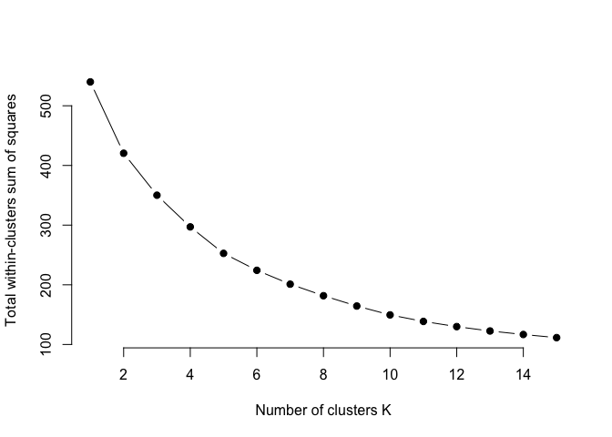<!-- -->

``` r
print(wss)
```

    ##  [1] 540.0000 420.4330 350.1114 297.0255 252.6801 224.2526 201.0807 181.6932
    ##  [9] 164.4121 149.5632 138.6363 129.9082 122.6248 116.7205 111.4801

As we can see here, that the `between_ss/total_ss` ratio tends to change
slowly and remain less changing for `k > 2`, so we’ll take `k = 2` as
the optimal number of clusters. This can also be verified using `kmeans`

``` r
# make groups for the clusters
my_data.groups <- cutree(my_data.hcluster, k = 2)

# plot the cluster
clusplot(
    my_data,
    my_data.groups,
    color = TRUE,
    shade = TRUE,
    lines = 0,
    labels = 2
)
```

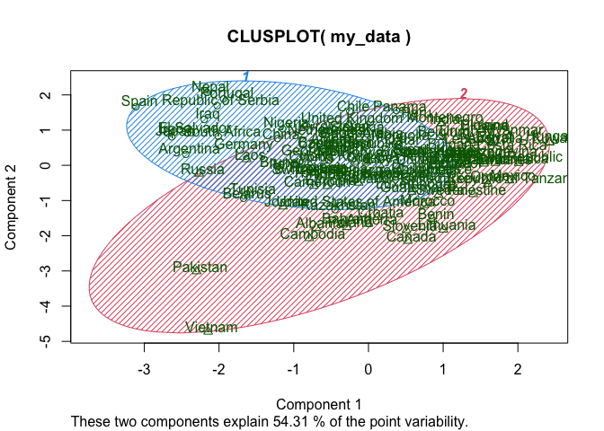<!-- -->

We can also see the clustering in form of `dandeogram`

``` r
my_data.dendrogram <- as.dendrogram(my_data.hcluster)

node_parameters <-
    list(
        lab.cex = 0.6,
        pch = c(NA, 19),
        cex = 0.7,
        col = "blue"
    )

plot(my_data.dendrogram,
     nodePar = node_parameters,
     edgePar = list(col = 1:2, lwd = 2:1))
```

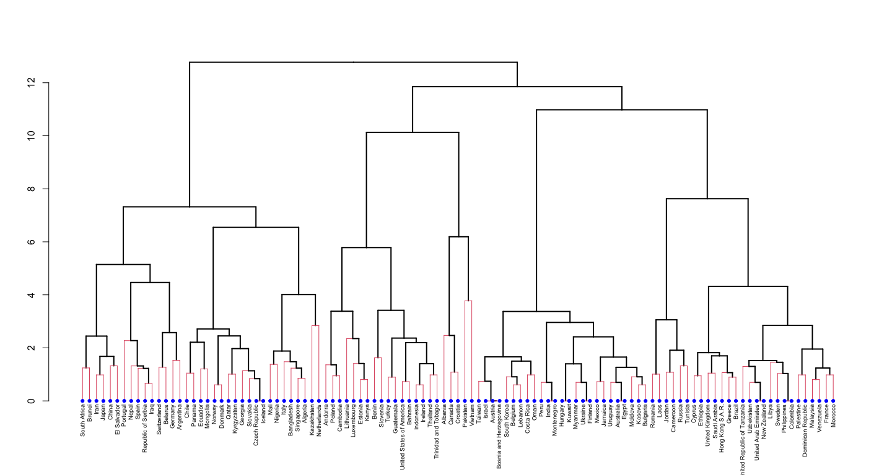

We observe here that the countries on the same cluster level as
`Bangladesh` are,

1.  `Singapore`
2.  `Algeria`
3.  `Italy`
4.  `Nigeria`, and
5.  `Mali`

For this case study, we consider the countries with higher number of
participants than the focus country to have a decent sample size. For
this, we can check the dimensions of each selected country.

``` r
countries <- c("Singapore", "Algeria", "Italy", "Nigeria", "Mali", "Bangladesh")

for (country in countries) {
    print(paste("participants from ", country, "=", dim(cv_base[cv_base$coded_country == country,])[1]))
}
```

    ## [1] "participants from  Singapore = 143"
    ## [1] "participants from  Algeria = 110"
    ## [1] "participants from  Italy = 1214"
    ## [1] "participants from  Nigeria = 3"
    ## [1] "participants from  Mali = 6"
    ## [1] "participants from  Bangladesh = 84"

Based on the number of participants, we limit the selection to
`Singapore`, `Algeria`, and `Italy` as a cluster. In order to study the
Pro-Social behaviors we combine these countries and search for the
predictors again,

## Q3B) Joint predictor search

We create a subset of the original data that comprises of the four
required countries,

``` r
joint_df <- subset(
    cv_base,
    coded_country %in% c(
        'Singapore',
        'Algeria',
        'Italy'
    )
)

rownames(joint_df) <- NULL
```

Now we search for the predictors for Pro-Social behavior as described
above again for this joint country cluster

### `c19SoPro01`

``` r
joint_df.ProSo01.lm.fit <- lm(c19ProSo01~., data=joint_df[, -38])
summary(joint_df.ProSo01.lm.fit)
```

    ## 
    ## Call:
    ## lm(formula = c19ProSo01 ~ ., data = joint_df[, -38])
    ## 
    ## Residuals:
    ##     Min      1Q  Median      3Q     Max 
    ## -4.9766 -0.6301  0.1485  0.7585  3.7468 
    ## 
    ## Coefficients:
    ##                Estimate Std. Error t value Pr(>|t|)    
    ## (Intercept)   -0.322419   0.387219  -0.833 0.405179    
    ## affAnx        -0.105736   0.035846  -2.950 0.003232 ** 
    ## affBor        -0.024391   0.028406  -0.859 0.390670    
    ## affCalm       -0.005748   0.040657  -0.141 0.887599    
    ## affContent    -0.010229   0.038008  -0.269 0.787875    
    ## affDepr       -0.006071   0.038846  -0.156 0.875827    
    ## affEnerg       0.023028   0.039194   0.588 0.556942    
    ## affExc         0.038772   0.038582   1.005 0.315111    
    ## affNerv       -0.048627   0.038242  -1.272 0.203735    
    ## affExh         0.106158   0.032145   3.303 0.000982 ***
    ## affInsp        0.027990   0.035633   0.785 0.432294    
    ## affRel        -0.057555   0.039505  -1.457 0.145367    
    ## PLRAC19        0.003253   0.026888   0.121 0.903732    
    ## PLRAEco        0.040185   0.022497   1.786 0.074268 .  
    ## disc01        -0.112767   0.046948  -2.402 0.016434 *  
    ## disc02         0.142337   0.047862   2.974 0.002990 ** 
    ## disc03        -0.078191   0.040078  -1.951 0.051254 .  
    ## PFS01          0.093202   0.051882   1.796 0.072637 .  
    ## PFS02         -0.071786   0.037452  -1.917 0.055467 .  
    ## PFS03          0.007326   0.049085   0.149 0.881378    
    ## fail01         0.027433   0.037567   0.730 0.465362    
    ## fail02        -0.030822   0.035824  -0.860 0.389722    
    ## fail03        -0.052115   0.035671  -1.461 0.144239    
    ## happy         -0.024066   0.022746  -1.058 0.290210    
    ## lifeSat        0.053220   0.037902   1.404 0.160496    
    ## MLQ            0.038518   0.025514   1.510 0.131338    
    ## c19NormShould -0.026431   0.028947  -0.913 0.361358    
    ## c19NormDo      0.038141   0.024985   1.527 0.127091    
    ## c19IsStrict   -0.024910   0.037852  -0.658 0.510583    
    ## c19IsPunish    0.072487   0.031438   2.306 0.021271 *  
    ## c19IsOrg       0.064635   0.033505   1.929 0.053914 .  
    ## gender         0.222478   0.068840   3.232 0.001258 ** 
    ## age           -0.022214   0.020791  -1.068 0.285499    
    ## edu            0.014863   0.027530   0.540 0.589364    
    ## c19ProSo02     0.147379   0.026992   5.460 5.61e-08 ***
    ## c19ProSo03     0.274542   0.026313  10.434  < 2e-16 ***
    ## c19ProSo04     0.160399   0.029937   5.358 9.80e-08 ***
    ## n_jobs        -0.123297   0.085007  -1.450 0.147158    
    ## ---
    ## Signif. codes:  0 '***' 0.001 '**' 0.01 '*' 0.05 '.' 0.1 ' ' 1
    ## 
    ## Residual standard error: 1.218 on 1429 degrees of freedom
    ## Multiple R-squared:  0.3044, Adjusted R-squared:  0.2864 
    ## F-statistic:  16.9 on 37 and 1429 DF,  p-value: < 2.2e-16

``` r
joint_df.ProSo01.lm.fit.2 <-
    lm(c19ProSo01 ~ affAnx + affExh + disc01 + disc02 + c19IsPunish + gender,
       data = joint_df[,-38])
summary(joint_df.ProSo01.lm.fit.2)
```

    ## 
    ## Call:
    ## lm(formula = c19ProSo01 ~ affAnx + affExh + disc01 + disc02 + 
    ##     c19IsPunish + gender, data = joint_df[, -38])
    ## 
    ## Residuals:
    ##     Min      1Q  Median      3Q     Max 
    ## -4.4100 -0.9093  0.1867  1.0193  2.7807 
    ## 
    ## Coefficients:
    ##             Estimate Std. Error t value Pr(>|t|)    
    ## (Intercept)  0.22935    0.19637   1.168 0.243021    
    ## affAnx      -0.11087    0.03437  -3.226 0.001284 ** 
    ## affExh       0.06875    0.03378   2.035 0.042023 *  
    ## disc01      -0.17679    0.05132  -3.445 0.000587 ***
    ## disc02       0.22328    0.05368   4.159 3.38e-05 ***
    ## c19IsPunish  0.15260    0.02707   5.637 2.08e-08 ***
    ## gender       0.12385    0.07509   1.649 0.099263 .  
    ## ---
    ## Signif. codes:  0 '***' 0.001 '**' 0.01 '*' 0.05 '.' 0.1 ' ' 1
    ## 
    ## Residual standard error: 1.413 on 1460 degrees of freedom
    ## Multiple R-squared:  0.04438,    Adjusted R-squared:  0.04045 
    ## F-statistic:  11.3 on 6 and 1460 DF,  p-value: 2.272e-12

### `c19ProSo02`

``` r
joint_df.ProSo02.lm.fit <- lm(c19ProSo02~., data=joint_df[, -38])
summary(joint_df.ProSo02.lm.fit)
```

    ## 
    ## Call:
    ## lm(formula = c19ProSo02 ~ ., data = joint_df[, -38])
    ## 
    ## Residuals:
    ##     Min      1Q  Median      3Q     Max 
    ## -5.3095 -0.6241  0.0803  0.7306  4.2388 
    ## 
    ## Coefficients:
    ##                 Estimate Std. Error t value Pr(>|t|)    
    ## (Intercept)    0.9128041  0.3749063   2.435 0.015024 *  
    ## affAnx         0.1340472  0.0346945   3.864 0.000117 ***
    ## affBor        -0.0189077  0.0275557  -0.686 0.492722    
    ## affCalm       -0.0485953  0.0394153  -1.233 0.217815    
    ## affContent    -0.0416798  0.0368512  -1.131 0.258233    
    ## affDepr        0.0030496  0.0376800   0.081 0.935506    
    ## affEnerg       0.0257889  0.0380156   0.678 0.497642    
    ## affExc        -0.0421188  0.0374205  -1.126 0.260544    
    ## affNerv       -0.0726148  0.0370645  -1.959 0.050290 .  
    ## affExh        -0.0275672  0.0312897  -0.881 0.378449    
    ## affInsp        0.0331845  0.0345595   0.960 0.337111    
    ## affRel        -0.0143976  0.0383455  -0.375 0.707367    
    ## PLRAC19        0.0258751  0.0260718   0.992 0.321144    
    ## PLRAEco       -0.0757716  0.0217532  -3.483 0.000510 ***
    ## disc01        -0.0165735  0.0456277  -0.363 0.716484    
    ## disc02         0.0105066  0.0465674   0.226 0.821529    
    ## disc03         0.1088305  0.0388195   2.804 0.005123 ** 
    ## PFS01         -0.0538509  0.0503604  -1.069 0.285111    
    ## PFS02          0.0022852  0.0363736   0.063 0.949913    
    ## PFS03         -0.0061546  0.0476114  -0.129 0.897164    
    ## fail01        -0.0898861  0.0363684  -2.472 0.013569 *  
    ## fail02        -0.0310928  0.0347473  -0.895 0.371030    
    ## fail03         0.0446092  0.0346060   1.289 0.197586    
    ## happy          0.0058703  0.0220708   0.266 0.790298    
    ## lifeSat        0.0427939  0.0367722   1.164 0.244718    
    ## MLQ            0.0106269  0.0247656   0.429 0.667915    
    ## c19NormShould  0.1025084  0.0279552   3.667 0.000255 ***
    ## c19NormDo      0.0176307  0.0242501   0.727 0.467324    
    ## c19IsStrict   -0.0190113  0.0367178  -0.518 0.604701    
    ## c19IsPunish    0.0164454  0.0305480   0.538 0.590422    
    ## c19IsOrg      -0.0481843  0.0325162  -1.482 0.138599    
    ## gender        -0.1925937  0.0668231  -2.882 0.004009 ** 
    ## age           -0.0349398  0.0201537  -1.734 0.083193 .  
    ## edu            0.0014078  0.0267057   0.053 0.957966    
    ## c19ProSo01     0.1386616  0.0253957   5.460 5.61e-08 ***
    ## c19ProSo03     0.4446780  0.0237204  18.747  < 2e-16 ***
    ## c19ProSo04     0.0852409  0.0292415   2.915 0.003612 ** 
    ## n_jobs         0.0003021  0.0825151   0.004 0.997079    
    ## ---
    ## Signif. codes:  0 '***' 0.001 '**' 0.01 '*' 0.05 '.' 0.1 ' ' 1
    ## 
    ## Residual standard error: 1.182 on 1429 degrees of freedom
    ## Multiple R-squared:  0.4344, Adjusted R-squared:  0.4197 
    ## F-statistic: 29.66 on 37 and 1429 DF,  p-value: < 2.2e-16

``` r
joint_df.ProSo02.lm.fit.2 <-
    lm(c19ProSo02 ~ affAnx + PLRAEco + disc03 + fail01 + c19NormShould + gender,
       data = joint_df[, -38])
summary(joint_df.ProSo02.lm.fit.2)
```

    ## 
    ## Call:
    ## lm(formula = c19ProSo02 ~ affAnx + PLRAEco + disc03 + fail01 + 
    ##     c19NormShould + gender, data = joint_df[, -38])
    ## 
    ## Residuals:
    ##     Min      1Q  Median      3Q     Max 
    ## -4.7485 -0.7631  0.2238  1.0088  3.5469 
    ## 
    ## Coefficients:
    ##               Estimate Std. Error t value Pr(>|t|)    
    ## (Intercept)    0.84592    0.19154   4.416 1.08e-05 ***
    ## affAnx         0.09216    0.03250   2.836 0.004637 ** 
    ## PLRAEco       -0.08726    0.02359  -3.698 0.000225 ***
    ## disc03         0.16117    0.04220   3.819 0.000140 ***
    ## fail01        -0.22663    0.03640  -6.227 6.21e-10 ***
    ## c19NormShould  0.27668    0.03104   8.913  < 2e-16 ***
    ## gender        -0.18112    0.07719  -2.346 0.019089 *  
    ## ---
    ## Signif. codes:  0 '***' 0.001 '**' 0.01 '*' 0.05 '.' 0.1 ' ' 1
    ## 
    ## Residual standard error: 1.454 on 1460 degrees of freedom
    ## Multiple R-squared:  0.1251, Adjusted R-squared:  0.1215 
    ## F-statistic: 34.78 on 6 and 1460 DF,  p-value: < 2.2e-16

### `c19ProSo03`

``` r
joint_df.ProSo03.lm.fit <- lm(c19ProSo03~., data=joint_df[, -38])
summary(joint_df.ProSo03.lm.fit)
```

    ## 
    ## Call:
    ## lm(formula = c19ProSo03 ~ ., data = joint_df[, -38])
    ## 
    ## Residuals:
    ##     Min      1Q  Median      3Q     Max 
    ## -4.8741 -0.6216  0.1397  0.7232  5.6229 
    ## 
    ## Coefficients:
    ##                Estimate Std. Error t value Pr(>|t|)    
    ## (Intercept)   -1.622730   0.372887  -4.352 1.45e-05 ***
    ## affAnx        -0.015163   0.034842  -0.435  0.66349    
    ## affBor         0.017513   0.027532   0.636  0.52482    
    ## affCalm        0.029638   0.039394   0.752  0.45195    
    ## affContent     0.081467   0.036772   2.215  0.02689 *  
    ## affDepr       -0.043772   0.037629  -1.163  0.24492    
    ## affEnerg       0.014477   0.037986   0.381  0.70318    
    ## affExc         0.067243   0.037362   1.800  0.07210 .  
    ## affNerv        0.092961   0.037000   2.512  0.01210 *  
    ## affExh        -0.018853   0.031266  -0.603  0.54662    
    ## affInsp       -0.047416   0.034517  -1.374  0.16975    
    ## affRel        -0.009705   0.038313  -0.253  0.80005    
    ## PLRAC19        0.054510   0.026018   2.095  0.03634 *  
    ## PLRAEco       -0.005461   0.021826  -0.250  0.80246    
    ## disc01         0.076175   0.045545   1.673  0.09464 .  
    ## disc02        -0.025150   0.046522  -0.541  0.58886    
    ## disc03         0.046038   0.038873   1.184  0.23648    
    ## PFS01          0.019714   0.050333   0.392  0.69536    
    ## PFS02         -0.046044   0.036321  -1.268  0.20511    
    ## PFS03          0.023849   0.047565   0.501  0.61618    
    ## fail01        -0.028051   0.036406  -0.770  0.44114    
    ## fail02         0.037084   0.034712   1.068  0.28556    
    ## fail03        -0.004169   0.034595  -0.120  0.90411    
    ## happy          0.017025   0.022047   0.772  0.44013    
    ## lifeSat       -0.048162   0.036735  -1.311  0.19005    
    ## MLQ            0.007021   0.024745   0.284  0.77664    
    ## c19NormShould -0.016385   0.028058  -0.584  0.55934    
    ## c19NormDo      0.010185   0.024232   0.420  0.67432    
    ## c19IsStrict    0.028048   0.036681   0.765  0.44461    
    ## c19IsPunish   -0.001082   0.030524  -0.035  0.97174    
    ## c19IsOrg       0.030954   0.032502   0.952  0.34106    
    ## gender         0.208421   0.066730   3.123  0.00182 ** 
    ## age           -0.028929   0.020142  -1.436  0.15116    
    ## edu            0.084830   0.026588   3.191  0.00145 ** 
    ## c19ProSo01     0.257845   0.024712  10.434  < 2e-16 ***
    ## c19ProSo02     0.443890   0.023678  18.747  < 2e-16 ***
    ## c19ProSo04     0.205131   0.028795   7.124 1.66e-12 ***
    ## n_jobs        -0.035719   0.082437  -0.433  0.66487    
    ## ---
    ## Signif. codes:  0 '***' 0.001 '**' 0.01 '*' 0.05 '.' 0.1 ' ' 1
    ## 
    ## Residual standard error: 1.181 on 1429 degrees of freedom
    ## Multiple R-squared:  0.4603, Adjusted R-squared:  0.4463 
    ## F-statistic: 32.94 on 37 and 1429 DF,  p-value: < 2.2e-16

``` r
joint_df.ProSo03.lm.fit.2 <-
    lm(c19ProSo03 ~ affContent + affNerv + PLRAEco + gender,
       data = joint_df[,-38])
summary(joint_df.ProSo03.lm.fit.2)
```

    ## 
    ## Call:
    ## lm(formula = c19ProSo03 ~ affContent + affNerv + PLRAEco + gender, 
    ##     data = joint_df[, -38])
    ## 
    ## Residuals:
    ##     Min      1Q  Median      3Q     Max 
    ## -4.1283 -0.7928  0.2258  1.3098  2.7447 
    ## 
    ## Coefficients:
    ##             Estimate Std. Error t value Pr(>|t|)    
    ## (Intercept)  0.32456    0.22021   1.474    0.141    
    ## affContent   0.17848    0.03908   4.567 5.37e-06 ***
    ## affNerv      0.04865    0.03636   1.338    0.181    
    ## PLRAEco     -0.04584    0.02528  -1.813    0.070 .  
    ## gender      -0.02422    0.08259  -0.293    0.769    
    ## ---
    ## Signif. codes:  0 '***' 0.001 '**' 0.01 '*' 0.05 '.' 0.1 ' ' 1
    ## 
    ## Residual standard error: 1.574 on 1462 degrees of freedom
    ## Multiple R-squared:  0.01884,    Adjusted R-squared:  0.01615 
    ## F-statistic: 7.018 on 4 and 1462 DF,  p-value: 1.355e-05

### `c19ProSo04`

``` r
joint_df.ProSo04.lm.fit <- lm(c19ProSo04~., data=joint_df[, -38])
summary(joint_df.ProSo04.lm.fit)
```

    ## 
    ## Call:
    ## lm(formula = c19ProSo04 ~ ., data = joint_df[, -38])
    ## 
    ## Residuals:
    ##     Min      1Q  Median      3Q     Max 
    ## -4.4930 -0.5255  0.1183  0.6704  3.0762 
    ## 
    ## Coefficients:
    ##                Estimate Std. Error t value Pr(>|t|)    
    ## (Intercept)    0.861142   0.338092   2.547 0.010967 *  
    ## affAnx        -0.026909   0.031449  -0.856 0.392339    
    ## affBor        -0.023160   0.024851  -0.932 0.351532    
    ## affCalm        0.040715   0.035554   1.145 0.252336    
    ## affContent    -0.064898   0.033210  -1.954 0.050873 .  
    ## affDepr        0.001988   0.033987   0.058 0.953362    
    ## affEnerg      -0.004345   0.034295  -0.127 0.899202    
    ## affExc        -0.069062   0.033718  -2.048 0.040720 *  
    ## affNerv        0.004508   0.033476   0.135 0.892897    
    ## affExh        -0.009164   0.028229  -0.325 0.745516    
    ## affInsp        0.060917   0.031140   1.956 0.050636 .  
    ## affRel         0.008150   0.034588   0.236 0.813762    
    ## PLRAC19        0.018398   0.023519   0.782 0.434196    
    ## PLRAEco        0.013407   0.019701   0.681 0.496274    
    ## disc01        -0.117569   0.041040  -2.865 0.004234 ** 
    ## disc02         0.104323   0.041913   2.489 0.012922 *  
    ## disc03        -0.058651   0.035076  -1.672 0.094724 .  
    ## PFS01         -0.053626   0.045420  -1.181 0.237931    
    ## PFS02          0.110611   0.032678   3.385 0.000731 ***
    ## PFS03          0.006834   0.042944   0.159 0.873578    
    ## fail01         0.024843   0.032867   0.756 0.449848    
    ## fail02        -0.070278   0.031295  -2.246 0.024879 *  
    ## fail03         0.077564   0.031165   2.489 0.012929 *  
    ## happy         -0.027679   0.019894  -1.391 0.164354    
    ## lifeSat        0.043516   0.033164   1.312 0.189680    
    ## MLQ            0.005873   0.022339   0.263 0.792671    
    ## c19NormShould  0.278288   0.024240  11.480  < 2e-16 ***
    ## c19NormDo      0.012871   0.021875   0.588 0.556346    
    ## c19IsStrict    0.038353   0.033106   1.158 0.246862    
    ## c19IsPunish   -0.028321   0.027546  -1.028 0.304063    
    ## c19IsOrg       0.004458   0.029351   0.152 0.879289    
    ## gender        -0.232074   0.060135  -3.859 0.000119 ***
    ## age           -0.002076   0.018197  -0.114 0.909177    
    ## edu           -0.001332   0.024088  -0.055 0.955916    
    ## c19ProSo01     0.122777   0.022915   5.358 9.80e-08 ***
    ## c19ProSo02     0.069349   0.023790   2.915 0.003612 ** 
    ## c19ProSo03     0.167184   0.023469   7.124 1.66e-12 ***
    ## n_jobs         0.180564   0.074274   2.431 0.015177 *  
    ## ---
    ## Signif. codes:  0 '***' 0.001 '**' 0.01 '*' 0.05 '.' 0.1 ' ' 1
    ## 
    ## Residual standard error: 1.066 on 1429 degrees of freedom
    ## Multiple R-squared:  0.3112, Adjusted R-squared:  0.2933 
    ## F-statistic: 17.45 on 37 and 1429 DF,  p-value: < 2.2e-16

``` r
joint_df.ProSo04.lm.fit.2 <-
    lm(c19ProSo04 ~ affExc + disc01 + disc02 + PFS02 + fail02 + fail03 + c19NormShould + gender,
       data = joint_df[,-38])
summary(joint_df.ProSo04.lm.fit.2)
```

    ## 
    ## Call:
    ## lm(formula = c19ProSo04 ~ affExc + disc01 + disc02 + PFS02 + 
    ##     fail02 + fail03 + c19NormShould + gender, data = joint_df[, 
    ##     -38])
    ## 
    ## Residuals:
    ##     Min      1Q  Median      3Q     Max 
    ## -5.0840 -0.5125  0.2213  0.7988  3.0541 
    ## 
    ## Coefficients:
    ##               Estimate Std. Error t value Pr(>|t|)    
    ## (Intercept)    1.22049    0.12537   9.735  < 2e-16 ***
    ## affExc        -0.03069    0.03142  -0.977 0.328849    
    ## disc01        -0.16137    0.04214  -3.829 0.000134 ***
    ## disc02         0.17098    0.04442   3.849 0.000124 ***
    ## PFS02          0.06273    0.02998   2.092 0.036583 *  
    ## fail02        -0.12586    0.02983  -4.220  2.6e-05 ***
    ## fail03         0.09026    0.03147   2.868 0.004184 ** 
    ## c19NormShould  0.36540    0.02475  14.766  < 2e-16 ***
    ## gender        -0.18448    0.06121  -3.014 0.002624 ** 
    ## ---
    ## Signif. codes:  0 '***' 0.001 '**' 0.01 '*' 0.05 '.' 0.1 ' ' 1
    ## 
    ## Residual standard error: 1.153 on 1458 degrees of freedom
    ## Multiple R-squared:  0.178,  Adjusted R-squared:  0.1735 
    ## F-statistic: 39.47 on 8 and 1458 DF,  p-value: < 2.2e-16

#### Summary \| Joint cluster

Below, we summarize the important predictors for Pro-Social behavior for
the joint country cluster,

<div class="tabwid"><style>.cl-41c888aa{}.cl-41c5a28e{font-family:'Helvetica';font-size:11pt;font-weight:normal;font-style:normal;text-decoration:none;color:rgba(0, 0, 0, 1.00);background-color:transparent;}.cl-41c6e3ec{margin:0;text-align:left;border-bottom: 0 solid rgba(0, 0, 0, 1.00);border-top: 0 solid rgba(0, 0, 0, 1.00);border-left: 0 solid rgba(0, 0, 0, 1.00);border-right: 0 solid rgba(0, 0, 0, 1.00);padding-bottom:5pt;padding-top:5pt;padding-left:5pt;padding-right:5pt;line-height: 1;background-color:transparent;}.cl-41c6eb6c{width:2in;background-color:transparent;vertical-align: middle;border-bottom: 1.5pt solid rgba(102, 102, 102, 1.00);border-top: 1.5pt solid rgba(102, 102, 102, 1.00);border-left: 0 solid rgba(0, 0, 0, 1.00);border-right: 0 solid rgba(0, 0, 0, 1.00);margin-bottom:0;margin-top:0;margin-left:0;margin-right:0;}.cl-41c6eb6d{width:2in;background-color:transparent;vertical-align: middle;border-bottom: 0 solid rgba(0, 0, 0, 1.00);border-top: 0 solid rgba(0, 0, 0, 1.00);border-left: 0 solid rgba(0, 0, 0, 1.00);border-right: 0 solid rgba(0, 0, 0, 1.00);margin-bottom:0;margin-top:0;margin-left:0;margin-right:0;}.cl-41c6eb76{width:2in;background-color:transparent;vertical-align: middle;border-bottom: 1.5pt solid rgba(102, 102, 102, 1.00);border-top: 0 solid rgba(0, 0, 0, 1.00);border-left: 0 solid rgba(0, 0, 0, 1.00);border-right: 0 solid rgba(0, 0, 0, 1.00);margin-bottom:0;margin-top:0;margin-left:0;margin-right:0;}</style><table data-quarto-disable-processing='true' class='cl-41c888aa'><thead><tr style="overflow-wrap:break-word;"><th class="cl-41c6eb6c"><p class="cl-41c6e3ec"><span class="cl-41c5a28e">Quantity</span></p></th><th class="cl-41c6eb6c"><p class="cl-41c6e3ec"><span class="cl-41c5a28e">Predictors</span></p></th><th class="cl-41c6eb6c"><p class="cl-41c6e3ec"><span class="cl-41c5a28e">Quality</span></p></th></tr></thead><tbody><tr style="overflow-wrap:break-word;"><td class="cl-41c6eb6d"><p class="cl-41c6e3ec"><span class="cl-41c5a28e">c19ProSo01</span></p></td><td class="cl-41c6eb6d"><p class="cl-41c6e3ec"><span class="cl-41c5a28e">affAnx</span><br><span class="cl-41c5a28e"> affExh</span><br><span class="cl-41c5a28e"> disc01</span><br><span class="cl-41c5a28e"> disc02</span><br><span class="cl-41c5a28e"> c19IsPunish</span></p></td><td class="cl-41c6eb6d"><p class="cl-41c6e3ec"><span class="cl-41c5a28e">**</span><br><span class="cl-41c5a28e"> *</span><br><span class="cl-41c5a28e"> ***</span><br><span class="cl-41c5a28e"> ***</span><br><span class="cl-41c5a28e"> ***</span></p></td></tr><tr style="overflow-wrap:break-word;"><td class="cl-41c6eb6d"><p class="cl-41c6e3ec"><span class="cl-41c5a28e">c19ProSo02</span></p></td><td class="cl-41c6eb6d"><p class="cl-41c6e3ec"><span class="cl-41c5a28e">affAnx</span><br><span class="cl-41c5a28e"> PLRAEco</span><br><span class="cl-41c5a28e"> disc03</span><br><span class="cl-41c5a28e"> fail01</span><br><span class="cl-41c5a28e"> c19NormShould</span></p></td><td class="cl-41c6eb6d"><p class="cl-41c6e3ec"><span class="cl-41c5a28e">**</span><br><span class="cl-41c5a28e"> ***</span><br><span class="cl-41c5a28e"> ***</span><br><span class="cl-41c5a28e"> ***</span><br><span class="cl-41c5a28e"> ***</span></p></td></tr><tr style="overflow-wrap:break-word;"><td class="cl-41c6eb6d"><p class="cl-41c6e3ec"><span class="cl-41c5a28e">c19ProSo03</span></p></td><td class="cl-41c6eb6d"><p class="cl-41c6e3ec"><span class="cl-41c5a28e">affContent</span></p></td><td class="cl-41c6eb6d"><p class="cl-41c6e3ec"><span class="cl-41c5a28e">***</span></p></td></tr><tr style="overflow-wrap:break-word;"><td class="cl-41c6eb76"><p class="cl-41c6e3ec"><span class="cl-41c5a28e">c19ProSo04</span></p></td><td class="cl-41c6eb76"><p class="cl-41c6e3ec"><span class="cl-41c5a28e">disc01</span><br><span class="cl-41c5a28e"> disc02</span><br><span class="cl-41c5a28e"> fail02</span><br><span class="cl-41c5a28e"> fail03</span><br><span class="cl-41c5a28e"> c19NormShould</span><br><span class="cl-41c5a28e"> gender</span></p></td><td class="cl-41c6eb76"><p class="cl-41c6e3ec"><span class="cl-41c5a28e">***</span><br><span class="cl-41c5a28e"> ***</span><br><span class="cl-41c5a28e"> *</span><br><span class="cl-41c5a28e"> ***</span><br><span class="cl-41c5a28e"> **</span><br><span class="cl-41c5a28e"> ***</span><br><span class="cl-41c5a28e"> **</span></p></td></tr></tbody></table></div>

## Q3C) Explanation and comparison

The joint cluster of `Singapore`, `Algeria`, and `Italy` provides some
predictors for the Pro-Social behaviors, and some are found to be quite
significant.

While no common predictor was found for the cluster and the focus
country alone, but we do see similar predictors in some cases. For
example, `c19ProSo02` has `Affect` and `Fail` predictors.
`Corona Injunctive Norms` predictors are also found in `c19proSo01` for
both these cases.

This behavior of predictors may suggest that the prediction should be
done for each `Concept` individually or a better predictive measure
should be taken into account.

As a comparison to the cluster and the rest of the world, we can again
take a look at the comparison plot for the mean concept values

``` r
world_df <- subset(cv_base,!coded_country %in% c("Singapore",
                                                 "Algeria",
                                                 "Italy"))

rownames(joint_df) <- NULL
joint_df.mean <- colMeans(joint_df[,-38], na.rm = TRUE)
world_df.mean <- colMeans(world_df[,-38], na.rm = TRUE)

difference_ <- joint_df.mean - world_df.mean

mean_ <- mean(difference_)
sd_ <- sd(difference_)

plot(
    difference_,
    main = "Parameter difference between\nthe joint cluster and rest of the world",
    xlab = "Parameter Number",
    ylab = "Difference",
    xlim = c(-1, 40)
)

abline(
    h = mean_,
    col = 'red',
    lwd = 3,
    lty = 2
)
abline(
    h = mean_ + sd_,
    col = 'pink',
    lwd = 3,
    lty = 3
)
abline(
    h = mean_ - sd_,
    col = 'pink',
    lwd = 3,
    lty = 3
)
text(seq(1:length(world_df[,-38])) - 0.1, difference_ + 0.02, names(world_df[,-38]))

legend(
    0,
    -0.85,
    legend = c('Mean difference value', 'Mean +/- SD'),
    col = c('red', 'pink'),
    lty = c(2, 3),
    lwd = 3
)
```

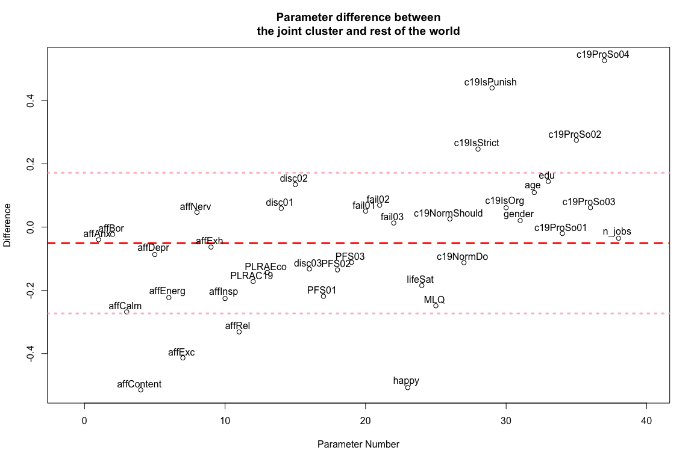

With the clustered data, we see a decrease in range of difference from
the rest of the world. The people in the joint cluster are not
**energetic** on average compared to the rest of the world and have more
**anxiety**, and **nervousness**. It should be noted that they people in
this cluster have a lot of behaviors within `1σ` standard deviation.

Overall, they are **not** **happier** on average and they think highly
of the **COVID norms**. These factors indicate a variation from the
focused country although they belong to the same cluster.

It is also to be noted that since the focus country doens’t has too many
predictors, both the joint cluster and the world wide cluster do not
represent the patterns of the focus country any better. But the similar
cluster does show few indicators for Pro-Social behavior as does the
focus country analysis.

# Appendix

## Selection of the clustering variables

For the clustering of the variable, the online table was consulted and
parameters present in the data set matching the description were
selected with the following values.

|        Variable        | Rank | Permutation Importance |
|:----------------------:|:----:|:----------------------:|
| Should social distance |  1   |         0.154          |
|   Do social distance   |  7   |         0.031          |
|   Life Satisfaction    |  47  |         0.004          |
|    Sense of purpose    |  48  |         0.004          |
|    Dis-empowerment     |  53  |         0.003          |
